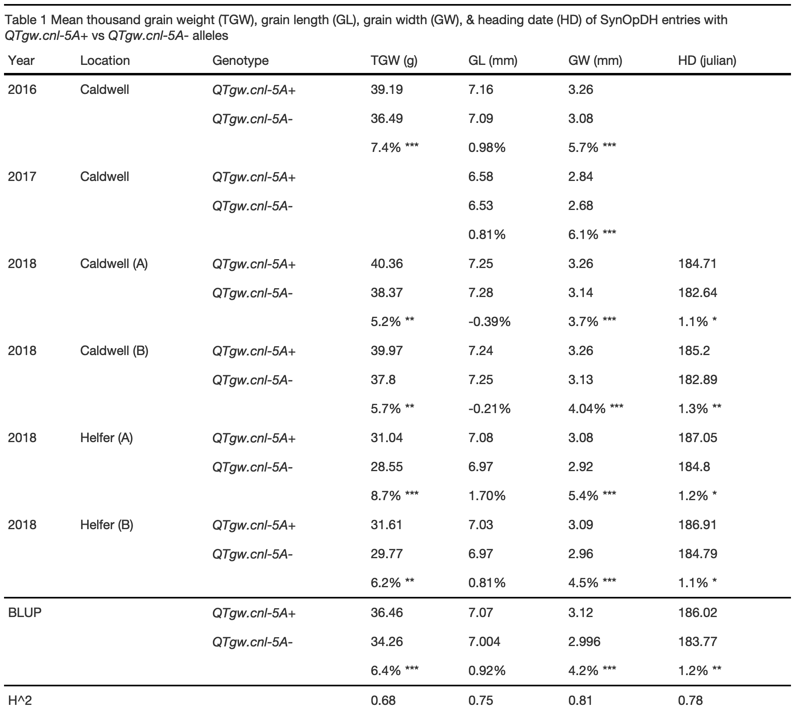
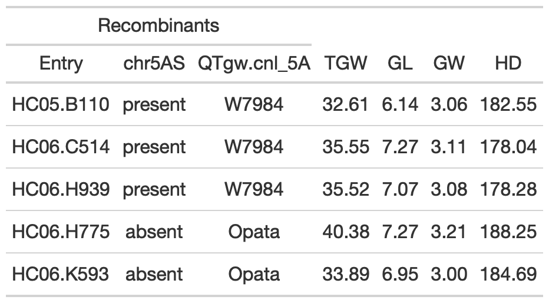
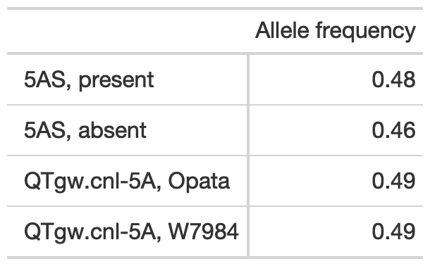
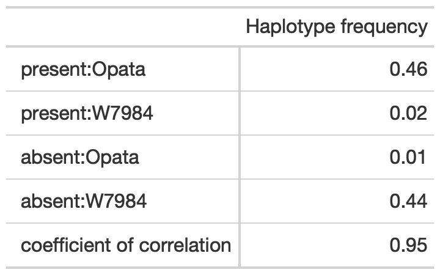

script\_S1: SynOpDH analysis
================

All packages, data, and statistical analysis for reproducing SynOpDH
population results reported in Taagen et al. 2021. Please see
`script_S1.Rmd` for full R script.

**Load packages**

``` r
library(tidyverse) # R/tidyverse version 1.3.0
library(lme4) #R/lme4 package version 1.1-21 
library(knitr) # R/knitr package version 1.28 
library(kableExtra) # R/kableExtra package version 1.1.0
library(qtl) #R/qtl package version 1.46-2
library(tibble) # R/tible package version 2.1.3 
library(ggpubr) # R/ggpubr package version 0.2.5 
library(scales) # R/scales package version 1.1.0
library(svglite) #R/svglite version 1.2.3.2
library(gt) #R/gt version 0.2.2
library(car) # R/car package version 3.0-10
library(emmeans) # R/emmeans package version 1.4.6
library(rstatix) # R/rstatix package version 0.6.0
```

### SynOpDH broad sense heritability and BLUP phenotypes

A 162-entry subset of 215 SynOpDH entries were grown in headrows in four
field-year combinations, with up to six replicates per entry, from
2016-2018 in Ithaca, NY. Univariate mixed linear models with random
environment and genotype effects were fitted with the R/lme4 package to
obtain best linear unbiased predictions (BLUPs) for TGW, GL, GW and HD
phenotypes across the four environments.

**Load data**

``` r
SynOpDH_Phenotypes <- read_csv("https://raw.githubusercontent.com/etaagen/Taagen_2021_TPG/main/supplementary_1/file_S1.1.csv", na = "")
SynOpDH_Phenotypes$SynOpDH_entry = as.factor(SynOpDH_Phenotypes$SynOpDH_entry)
SynOpDH_Phenotypes$Year = as.factor(SynOpDH_Phenotypes$Year)
SynOpDH_Phenotypes$Location = as.factor(SynOpDH_Phenotypes$Location)
SynOpDH_Phenotypes$Rep = as.factor(SynOpDH_Phenotypes$Rep)
SynOpDH_Phenotypes$Environment = as.factor(SynOpDH_Phenotypes$Environment)
```

**Falconer & Mackay `H^2` estimate function**

\[ 
H^2 = \frac{\sigma^2_G}{\sigma^2_G + \frac{\sigma^2_{GxE}}{l} + \frac{\sigma^2_r}{rl}}
\]

Where \(H^2\) is the broad-sense heritability estimate, \(\sigma^2_G\)
is the genetic variance, \(\sigma^2_{GxE}\) is the genotype x
environment variance, \(\sigma^2_r\) is the residual variance, \(l\) is
the number of environments, and \(r\) is the number of unique
observations.

**TGW**

<table class="table table-striped table-hover table-condensed table-responsive" style="width: auto !important; margin-left: auto; margin-right: auto;border-bottom: 0;">

<thead>

<tr>

<th style="text-align:left;">

Mixed model<sup>a</sup>

</th>

<th style="text-align:right;">

TGW H^2<sup>b</sup>

</th>

<th style="text-align:right;">

AIC<sup>c</sup>

</th>

</tr>

</thead>

<tbody>

<tr>

<td style="text-align:left;">

TGW \~ (1|Entry)

</td>

<td style="text-align:right;">

NA

</td>

<td style="text-align:right;">

4638.53

</td>

</tr>

<tr>

<td style="text-align:left;">

TGW \~ (1|Entry) + (1|Env)

</td>

<td style="text-align:right;">

0.70

</td>

<td style="text-align:right;">

3710.14

</td>

</tr>

<tr>

<td style="text-align:left;">

TGW \~ (1|Entry) + (1|Env) + Rep

</td>

<td style="text-align:right;">

0.70

</td>

<td style="text-align:right;">

3710.86

</td>

</tr>

<tr>

<td style="text-align:left;">

TGW \~ (1|Entry) + (1|Rep:Env)

</td>

<td style="text-align:right;">

0.69

</td>

<td style="text-align:right;">

3709.09

</td>

</tr>

<tr>

<td style="text-align:left;">

TGW \~ (1|Entry) + (1|Rep:Env) + (1|Entry:Env)

</td>

<td style="text-align:right;">

0.65

</td>

<td style="text-align:right;">

3704.04

</td>

</tr>

<tr>

<td style="text-align:left;">

TGW \~ (1|Entry) + (1|Rep:Env) + HD

</td>

<td style="text-align:right;">

0.68

</td>

<td style="text-align:right;">

2993.01

</td>

</tr>

</tbody>

<tfoot>

<tr>

<td style="padding: 0; " colspan="100%">

<sup>a</sup> Mixed model variables are defined as: thousand grain weight
(TGW), SynOpDH line entry (Entry), year environment unique to location
and year (Env), replicate (Rep), heading date (HD), <sup>b</sup> Broad
sense heritability calculated with Falconer & Mackay 1996 formula
<sup>c</sup> AIC was calculated using `AIC` in R/stats package

</td>

</tr>

</tfoot>

</table>

**GL**

<table class="table table-striped table-hover table-condensed table-responsive" style="width: auto !important; margin-left: auto; margin-right: auto;border-bottom: 0;">

<thead>

<tr>

<th style="text-align:left;">

Mixed model<sup>a</sup>

</th>

<th style="text-align:right;">

GL H^2<sup>b</sup>

</th>

<th style="text-align:right;">

AIC<sup>c</sup>

</th>

</tr>

</thead>

<tbody>

<tr>

<td style="text-align:left;">

GL \~ (1|Entry)

</td>

<td style="text-align:right;">

NA

</td>

<td style="text-align:right;">

805.15

</td>

</tr>

<tr>

<td style="text-align:left;">

GL \~ (1|Entry) + (1|Env)

</td>

<td style="text-align:right;">

0.82

</td>

<td style="text-align:right;">

70.58

</td>

</tr>

<tr>

<td style="text-align:left;">

GL \~ (1|Entry) + (1|Env) + Rep

</td>

<td style="text-align:right;">

0.82

</td>

<td style="text-align:right;">

70.93

</td>

</tr>

<tr>

<td style="text-align:left;">

GL \~ (1|Entry) + (1|Rep:Env)

</td>

<td style="text-align:right;">

0.83

</td>

<td style="text-align:right;">

79.33

</td>

</tr>

<tr>

<td style="text-align:left;">

GL \~ (1|Entry) + (1|Rep:Env) + (1|Entry:Env)

</td>

<td style="text-align:right;">

0.75

</td>

<td style="text-align:right;">

\-50.85

</td>

</tr>

</tbody>

<tfoot>

<tr>

<td style="padding: 0; " colspan="100%">

<sup>a</sup> Mixed model variables are defined as: grain length (GL),
SynOpDH line entry (Entry), year environment unique to location and year
(Env), replicate (Rep), heading date (HD), <sup>b</sup> Broad sense
heritability calculated with Falconer & Mackay 1996 formula <sup>c</sup>
AIC was calculated using `AIC` in R/stats package

</td>

</tr>

</tfoot>

</table>

**GW**

<table class="table table-striped table-hover table-condensed table-responsive" style="width: auto !important; margin-left: auto; margin-right: auto;border-bottom: 0;">

<thead>

<tr>

<th style="text-align:left;">

Mixed model<sup>a</sup>

</th>

<th style="text-align:right;">

GW H^2<sup>b</sup>

</th>

<th style="text-align:right;">

AIC<sup>c</sup>

</th>

</tr>

</thead>

<tbody>

<tr>

<td style="text-align:left;">

GW \~ (1|Entry)

</td>

<td style="text-align:right;">

NA

</td>

<td style="text-align:right;">

\-192.52

</td>

</tr>

<tr>

<td style="text-align:left;">

GW \~ (1|Entry) + (1|Env)

</td>

<td style="text-align:right;">

0.72

</td>

<td style="text-align:right;">

\-1063.32

</td>

</tr>

<tr>

<td style="text-align:left;">

GW \~ (1|Entry) + (1|Env) + Rep

</td>

<td style="text-align:right;">

0.72

</td>

<td style="text-align:right;">

\-1062.49

</td>

</tr>

<tr>

<td style="text-align:left;">

GW \~ (1|Entry) + (1|Rep:Env)

</td>

<td style="text-align:right;">

0.74

</td>

<td style="text-align:right;">

\-1055.86

</td>

</tr>

<tr>

<td style="text-align:left;">

GW \~ (1|Entry) + (1|Rep:Env) + (1|Entry:Env)

</td>

<td style="text-align:right;">

0.64

</td>

<td style="text-align:right;">

\-1130.19

</td>

</tr>

<tr>

<td style="text-align:left;">

GW \~ (1|Entry) + (1|Rep:Env) + (1|Entry:Env) + HD

</td>

<td style="text-align:right;">

0.78

</td>

<td style="text-align:right;">

\-1136.80

</td>

</tr>

<tr>

<td style="text-align:left;">

GW \~ (1|Entry) + (1|Rep:Env) + HD

</td>

<td style="text-align:right;">

0.81

</td>

<td style="text-align:right;">

\-1137.19

</td>

</tr>

</tbody>

<tfoot>

<tr>

<td style="padding: 0; " colspan="100%">

<sup>a</sup> Mixed model variables are defined as: grain width (GW) ,
SynOpDH line entry (Entry), year environment unique to location and year
(Env), replicate (Rep), heading date (HD), <sup>b</sup> Broad sense
heritability calculated with Falconer & Mackay 1996 formula <sup>c</sup>
AIC was calculated using `AIC` in R/stats package

</td>

</tr>

</tfoot>

</table>

**HD**

<table class="table table-striped table-hover table-condensed table-responsive" style="width: auto !important; margin-left: auto; margin-right: auto;border-bottom: 0;">

<thead>

<tr>

<th style="text-align:left;">

Mixed model<sup>a</sup>

</th>

<th style="text-align:right;">

HD ^2<sup>b</sup>

</th>

<th style="text-align:right;">

AIC<sup>c</sup>

</th>

</tr>

</thead>

<tbody>

<tr>

<td style="text-align:left;">

HD \~ (1|Entry)

</td>

<td style="text-align:right;">

NA

</td>

<td style="text-align:right;">

2951.50

</td>

</tr>

<tr>

<td style="text-align:left;">

HD \~ (1|Entry) + (1|Env)

</td>

<td style="text-align:right;">

0.85

</td>

<td style="text-align:right;">

2764.46

</td>

</tr>

<tr>

<td style="text-align:left;">

HD \~ (1|Entry) + (1|Env) + Rep

</td>

<td style="text-align:right;">

0.85

</td>

<td style="text-align:right;">

2764.58

</td>

</tr>

<tr>

<td style="text-align:left;">

HD \~ (1|Entry) + (1|Rep:Env)

</td>

<td style="text-align:right;">

0.85

</td>

<td style="text-align:right;">

2769.31

</td>

</tr>

<tr>

<td style="text-align:left;">

HD \~ (1|Entry) + (1|Rep:Env) + (1|Entry:Env)

</td>

<td style="text-align:right;">

0.78

</td>

<td style="text-align:right;">

2756.02

</td>

</tr>

</tbody>

<tfoot>

<tr>

<td style="padding: 0; " colspan="100%">

<sup>a</sup> Mixed model variables are defined as: heading date (HD) ,
SynOpDH line entry (Entry), year environment unique to location and year
(Env), replicate (Rep) <sup>b</sup> Broad sense heritability calculated
with Falconer & Mackay 1996 formula <sup>c</sup> AIC was calculated
using `AIC` in R/stats package

</td>

</tr>

</tfoot>

</table>

### Select models, extract BLUPs

The models were selected based on low AIC value and improved H^2
estimate:

  - `TGW ~ (1|Entry) + (1|Rep:Env) + HD`

  - `GL ~ (1|Entry) + (1|Rep:Env) + (1|Entry:Env)`

  - `GW ~ (1|Entry) + (1|Rep:Env) + HD`

  - `HD ~ (1|Entry) + (1|Rep:Env) + (1|Entry:Env)`

**Extract random effects from univariate mixed linear models for entries
(obtain BLUPs):**

``` r
BLUP_TGW <- ranef(TGW_model5)$SynOpDH_entry 
BLUP_GL <- ranef(GL_model3.5)$SynOpDH_entry 
BLUP_GW <- ranef(GW_model5)$SynOpDH_entry 
BLUP_HD <- ranef(HD_model3.5)$SynOpDH_entry 
```

**Phenotype means, add to BLUP for scaled phenotype value:**

``` r
TGW_mean <- mean(SynOpDH_Phenotypes$TGW, na.rm = TRUE) 
BLUP_TGW <- BLUP_TGW + TGW_mean
names(BLUP_TGW)[1] <- "TGW"

GL_mean <- mean(SynOpDH_Phenotypes$GL, na.rm = TRUE)
BLUP_GL <- BLUP_GL + GL_mean
names(BLUP_GL)[1] <- "GL"

GW_mean <- mean(SynOpDH_Phenotypes$GW, na.rm = TRUE)
BLUP_GW <- BLUP_GW + GW_mean
names(BLUP_GW)[1] <- "GW"

HD_mean <- mean(SynOpDH_Phenotypes$HD, na.rm = TRUE)
BLUP_HD <- BLUP_HD + HD_mean
names(BLUP_HD)[1] <- "HD"
```

**Create csv files**  
*eval = FALSE, BLUP files in repo, `file_S1.8.csv`*

``` r
write.csv(BLUP_TGW, "SynOpDH_BLUP_TGW.csv")
write.csv(BLUP_GL, "SynOpDH_BLUP_GL.csv")
write.csv(BLUP_GW, "SynOpDH_BLUP_GW.csv")
write.csv(BLUP_HD, "SynOpDH_BLUP_HD.csv")
```

### SynOpDH Genetic Linkage Map

A genetic linkage map of the SynOpDH population was constructed from a
subset of 1,551 [GBS](https://doi.org/10.1371/journal.pone.0032253) and
[SSR](https://wheat.pw.usda.gov/cgi-bin/GG3/browse.cgi?class=marker)
markers using the maximum likelihood algorithm in `R/qtl`.

The `SynOpDH_Import_GeneticMap.csv` data set contains SynOpDH genotype
data and genetic positions of markers on all chromosomes, and an index
phenotype (TGW BLUP). The `SynOpDH_Import_GeneticMap.csv` marker order
has not been constructed using maximum likelihood, and markers are
spaced every cM. “A” genotype represent W7984 variants of genetic
markers, “B” genotype represent Opata variants of genetic markers.

**Load data**

``` r
SynOpDH <- read.cross("csvr",  file = "https://raw.githubusercontent.com/etaagen/Taagen_2021_TPG/main/supplementary_1/file_S1.2.csv", map.function = "kosambi", na.strings=c("-","NA"))
```

    ##  --Read the following data:
    ##   162  individuals
    ##   1551  markers
    ##   1  phenotypes
    ##  --Cross type: f2

``` r
SynOpDH<- convert2riself(SynOpDH) #changes cross type from f2 to inbred population

summary(SynOpDH)
```

    ##     RI strains via selfing
    ## 
    ##     No. individuals:    162 
    ## 
    ##     No. phenotypes:     1 
    ##     Percent phenotyped: 92.6 
    ## 
    ##     No. chromosomes:    21 
    ##         Autosomes:      1A 1B 1D 2A 2B 2D 3A 3B 3D 4A 4B 4D 5A 5B 5D 6A 6B 6D 7A 
    ##                         7B 7D 
    ## 
    ##     Total markers:      1551 
    ##     No. markers:        51 85 33 76 99 36 87 108 63 78 60 26 63 141 90 66 87 57 
    ##                         97 88 60 
    ##     Percent genotyped:  99.4 
    ##     Genotypes (%):      AA:49.6  BB:50.4

**Maximum likelihood genetic map**  
The import file contains genetic markers evenly spaced every cM. The
code below compares and selects the best marker order by maximum
likelihood analysis.

*Note: there is a small level of randomness when calculating marker
positions, even when receiving identical inputs and parameters*  
*Eval set to FALSE because computationally intensive, please set to TRUE
to validate results.*

``` r
est.map(SynOpDH, map.function = "kosambi") #restimate cM 
#1A
SynOpDH_ripple <- ripple(SynOpDH, chr = "1A", window = 2, method = "likelihood", map.function = "kosambi")
summary(SynOpDH_ripple) 
SynOpDH <- switch.order(SynOpDH, chr = "1A", SynOpDH_ripple[1,])
#1B
SynOpDH_ripple <- ripple(SynOpDH, chr = "1B", window = 2, method = "likelihood", map.function = "kosambi")
summary(SynOpDH_ripple)
SynOpDH <- switch.order(SynOpDH, chr = "1B", SynOpDH_ripple[1,])
#1D
SynOpDH_ripple <- ripple(SynOpDH, chr = "1D", window = 2, method = "likelihood", map.function = "kosambi")
summary(SynOpDH_ripple)
SynOpDH <- switch.order(SynOpDH, chr = "1D", SynOpDH_ripple[1,])
#2A
SynOpDH_ripple <- ripple(SynOpDH, chr = "2A", window = 2, method = "likelihood", map.function = "kosambi")
summary(SynOpDH_ripple)
SynOpDH <- switch.order(SynOpDH, chr = "2A", SynOpDH_ripple[1,])
#2B
SynOpDH_ripple <- ripple(SynOpDH, chr = "2B", window = 2, method = "likelihood", map.function = "kosambi")
summary(SynOpDH_ripple)
SynOpDH <- switch.order(SynOpDH, chr = "2B", SynOpDH_ripple[1,])
#2D
SynOpDH_ripple <- ripple(SynOpDH, chr = "2D", window = 2, method = "likelihood", map.function = "kosambi", maxit=10000)
summary(SynOpDH_ripple)
SynOpDH <- switch.order(SynOpDH, chr = "2D", SynOpDH_ripple[1,])
#3A
SynOpDH_ripple <- ripple(SynOpDH, chr = "3A", window = 2, method = "likelihood", map.function = "kosambi")
summary(SynOpDH_ripple)
SynOpDH <- switch.order(SynOpDH, chr = "3A", SynOpDH_ripple[1,])
#3B
SynOpDH_ripple <- ripple(SynOpDH, chr = "3B", window = 2, method = "likelihood", map.function = "kosambi")
summary(SynOpDH_ripple)
SynOpDH <- switch.order(SynOpDH, chr = "3B", SynOpDH_ripple[1,])
#3D
SynOpDH_ripple <- ripple(SynOpDH, chr = "3D", window = 2, method = "likelihood", map.function = "kosambi")
summary(SynOpDH_ripple)
SynOpDH <- switch.order(SynOpDH, chr = "3D", SynOpDH_ripple[1,])
#4A
SynOpDH_ripple <- ripple(SynOpDH, chr = "4A", window = 2, method = "likelihood", map.function = "kosambi")
summary(SynOpDH_ripple)
SynOpDH <- switch.order(SynOpDH, chr = "4A", SynOpDH_ripple[1,])
#4B
SynOpDH_ripple <- ripple(SynOpDH, chr = "4B", window = 2, method = "likelihood", map.function = "kosambi")
summary(SynOpDH_ripple)
SynOpDH <- switch.order(SynOpDH, chr = "4B", SynOpDH_ripple[1,])
#4D
SynOpDH_ripple <- ripple(SynOpDH, chr = "4D", window = 2, method = "likelihood", map.function = "kosambi", maxit = 10000)
summary(SynOpDH_ripple)
SynOpDH <- switch.order(SynOpDH, chr = "4D", SynOpDH_ripple[1,])
#5A
SynOpDH_ripple <- ripple(SynOpDH, chr = "5A", window = 2, method = "likelihood", map.function = "kosambi")
summary(SynOpDH_ripple)
SynOpDH <- switch.order(SynOpDH, chr = "5A", SynOpDH_ripple[1,])
#5B
SynOpDH_ripple <- ripple(SynOpDH, chr = "5B", window = 2, method = "likelihood", map.function = "kosambi")
summary(SynOpDH_ripple)
SynOpDH <- switch.order(SynOpDH, chr = "5B", SynOpDH_ripple[1,])
#5D
SynOpDH_ripple <- ripple(SynOpDH, chr = "5D", window = 2, method = "likelihood", map.function = "kosambi")
summary(SynOpDH_ripple)
SynOpDH <- switch.order(SynOpDH, chr = "5D", SynOpDH_ripple[1,])
#6A
SynOpDH_ripple <- ripple(SynOpDH, chr = "6A", window = 2, method = "likelihood", map.function = "kosambi")
summary(SynOpDH_ripple)
SynOpDH <- switch.order(SynOpDH, chr = "6A", SynOpDH_ripple[1,])
#6B
SynOpDH_ripple <- ripple(SynOpDH, chr = "6B", window = 2, method = "likelihood", map.function = "kosambi")
summary(SynOpDH_ripple)
SynOpDH <- switch.order(SynOpDH, chr = "6B", SynOpDH_ripple[1,])
#6D
SynOpDH_ripple <- ripple(SynOpDH, chr = "6D", window = 2, method = "likelihood", map.function = "kosambi")
summary(SynOpDH_ripple)
SynOpDH <- switch.order(SynOpDH, chr = "6D", SynOpDH_ripple[1,])
#7A
SynOpDH_ripple <- ripple(SynOpDH, chr = "7A", window = 2, method = "likelihood", map.function = "kosambi")
summary(SynOpDH_ripple)
SynOpDH <- switch.order(SynOpDH, chr = "7A", SynOpDH_ripple[1,])
#7B
SynOpDH_ripple <- ripple(SynOpDH, chr = "7B", window = 2, method = "likelihood", map.function = "kosambi")
summary(SynOpDH_ripple)
SynOpDH <- switch.order(SynOpDH, chr = "7B", SynOpDH_ripple[1,])
#7D
SynOpDH_ripple <- ripple(SynOpDH, chr = "7D", window = 2, method = "likelihood", map.function = "kosambi")
summary(SynOpDH_ripple)
SynOpDH <- switch.order(SynOpDH, chr = "7D", SynOpDH_ripple[1,])

plot.map(SynOpDH)
```

**Export map file:**  
*Eval set to False, `file_S1.9.csv` available in repo, and is the marker
order used for QTL mapping, import file `file_ S1.3.csv` and `file_
S1.4.csv`. Please set eval to TRUE to validate results*

``` r
SynOpDHMap<-pull.map(SynOpDH, as.table=T)
write.csv(SynOpDHMap, "file_S1.9.csv")
```

### QTL mapping

In order to associate SynOpDH genotype and phenotype data, QTL mapping
was performed with the R package “qtl”. The `file_ S1.3.csv` data set
contains all SynOpDH phenotype data, genotype data and genetic linkage
map positions (from `file_S1.9.csv`) of markers on all chromosomes. The
markers on chromosome 5A are in order of physical position, and a single
marker representing the chromosome 5AS structural variant has been
included as well (1,552 markers total). “A” genotype represent W7984
variants of genetic markers, “B” genotype represent Opata variants of
genetic markers.

**Load data**

``` r
#SynOpDH 5A physical positions
SynOpDH <- read.cross("csvr", file = "https://raw.githubusercontent.com/etaagen/Taagen_2021_TPG/main/supplementary_1/file_S1.3.csv", map.function = "kosambi", na.strings=c("-","NA"))
```

    ##  --Read the following data:
    ##   162  individuals
    ##   1552  markers
    ##   26  phenotypes
    ##  --Cross type: f2

``` r
#SynOpDH 5A cM
SynOpDH_cM <- read.cross("csvr", file = "https://raw.githubusercontent.com/etaagen/Taagen_2021_TPG/main/supplementary_1/file_S1.4.csv", map.function = "kosambi", na.strings=c("-","NA"))
```

    ##  --Read the following data:
    ##   162  individuals
    ##   1552  markers
    ##   26  phenotypes
    ##  --Cross type: f2

``` r
SynOpDH<-convert2riself(SynOpDH) #changes cross type from f2 to inbred selfing population
SynOpDH <- jittermap(SynOpDH) #some markers at same position 

SynOpDH_cM<-convert2riself(SynOpDH_cM) #changes cross type from f2 to inbred selfing population
SynOpDH_cM <- jittermap(SynOpDH_cM) #some markers at same position 

summary(SynOpDH)
```

    ##     RI strains via selfing
    ## 
    ##     No. individuals:    162 
    ## 
    ##     No. phenotypes:     26 
    ##     Percent phenotyped: 87 91.4 92 92 90.1 92.6 81.5 92 91.4 92 92 90.1 95.7 
    ##                         81.5 92 91.4 92 92 90.1 92.6 92.6 92.6 92.6 91.4 94.4 
    ##                         93.8 
    ## 
    ##     No. chromosomes:    21 
    ##         Autosomes:      1A 1B 1D 2A 2B 2D 3A 3B 3D 4A 4B 4D 5A 5B 5D 6A 6B 6D 7A 
    ##                         7B 7D 
    ## 
    ##     Total markers:      1552 
    ##     No. markers:        51 85 33 76 99 36 87 108 63 78 60 26 64 141 90 66 87 57 
    ##                         97 88 60 
    ##     Percent genotyped:  99.4 
    ##     Genotypes (%):      AA:49.6  BB:50.4

``` r
SynOpDH_map <- pull.map(SynOpDH, as.table=T)
```

**Scan for QTL**

``` r
#impute missing genotype
SynOpDH <- fill.geno(SynOpDH, method = "imp")
SynOpDH_cM <- fill.geno(SynOpDH_cM, method = "imp")

SynOpData <- calc.genoprob(SynOpDH, step = 0, map.function = "kosambi") 
SynOpData_cM <- calc.genoprob(SynOpDH_cM, step = 0, map.function = "kosambi") 

#warning, scanone will drop individuals with missing phenotypes
TGW_BLUP <- scanone(SynOpData, pheno.col = "BLUP_TGW", method = "hk")
GL_BLUP <- scanone(SynOpData, pheno.col = "BLUP_GL", method = "hk")
GW_BLUP <- scanone(SynOpData, pheno.col = "BLUP_GW", method = "hk") 
HD_BLUP <- scanone(SynOpData, pheno.col = "BLUP_HD", method = "hk") 

summary(TGW_perm <- scanone(SynOpData, pheno.col = "BLUP_TGW", method="hk", n.perm=1000))#5% 3.14
```

    ## Doing permutation in batch mode ...

    ## LOD thresholds (1000 permutations)
    ##      lod
    ## 5%  3.12
    ## 10% 2.84

``` r
summary(GL_perm <- scanone(SynOpData, pheno.col = "BLUP_GL", method="hk", n.perm=1000))#5% 3.19
```

    ## Doing permutation in batch mode ...

    ## LOD thresholds (1000 permutations)
    ##      lod
    ## 5%  3.07
    ## 10% 2.79

``` r
summary(GW_perm <- scanone(SynOpData, pheno.col = "BLUP_GW", method="hk", n.perm=1000))#5% 3.10
```

    ## Doing permutation in batch mode ...

    ## LOD thresholds (1000 permutations)
    ##      lod
    ## 5%  3.18
    ## 10% 2.83

``` r
summary(HD_perm <- scanone(SynOpData, pheno.col = "BLUP_HD", method="hk", n.perm=1000))#5% 3.07
```

    ## Doing permutation in batch mode ...

    ## LOD thresholds (1000 permutations)
    ##      lod
    ## 5%  3.19
    ## 10% 2.89

``` r
LOD_BLUP <- cbind(TGW_BLUP, GL_BLUP, GW_BLUP, HD_BLUP) 

#check cM 5A
TGW_BLUP_cM <- scanone(SynOpData_cM, pheno.col = "BLUP_TGW", method = "hk")
GL_BLUP_cM <- scanone(SynOpData_cM, pheno.col = "BLUP_GL", method = "hk")
GW_BLUP_cM <- scanone(SynOpData_cM, pheno.col = "BLUP_GW", method = "hk") 
HD_BLUP_cM <- scanone(SynOpData_cM, pheno.col = "BLUP_HD", method = "hk") 
```

### QTL Summary

<!-- -->

### Phenotype variation explained by QTL

`% var = 1 - 10^(-2 * LOD / n)`
<!-- -->

### QTL plots

<!-- --><!-- --><!-- -->

### Figure 1B

<!-- -->

### QTL physical postions

<!-- -->

### Test for interaction between 2D, 5A and 6A TGW QTL

    ## Analysis of Deviance Table (Type II Wald chisquare tests)
    ## 
    ## Response: TGW
    ##                                       Chisq Df Pr(>Chisq)    
    ## QTL2D_synopGBS1212                  29.1425  1  6.725e-08 ***
    ## QTL5A_wmc705                        28.0831  1  1.162e-07 ***
    ## QTL6A_synopGBS42                    20.9094  1  4.815e-06 ***
    ## QTL2D_synopGBS1212:QTL5A_wmc705      0.1849  1    0.66722    
    ## QTL5A_wmc705:QTL6A_synopGBS42        3.2000  1    0.07364 .  
    ## QTL2D_synopGBS1212:QTL6A_synopGBS42  0.0159  1    0.89953    
    ## ---
    ## Signif. codes:  0 '***' 0.001 '**' 0.01 '*' 0.05 '.' 0.1 ' ' 1

### Phenotypes across years, Table 1

``` r
cald16 <- SynOpDH_Phenotypes %>% 
  filter(Location == "Caldwell" & Year == "2016") 
summary(aov(TGW ~ QTL5A_wmc705, data = cald16))
```

    ##               Df Sum Sq Mean Sq F value   Pr(>F)    
    ## QTL5A_wmc705   2  567.1  283.55   19.72 2.93e-08 ***
    ## Residuals    138 1984.3   14.38                     
    ## ---
    ## Signif. codes:  0 '***' 0.001 '**' 0.01 '*' 0.05 '.' 0.1 ' ' 1
    ## 21 observations deleted due to missingness

``` r
summary(aov(GL ~ QTL5A_wmc705, data = cald16))
```

    ##               Df Sum Sq Mean Sq F value Pr(>F)
    ## QTL5A_wmc705   1  0.172  0.1715   1.214  0.273
    ## Residuals    130 18.371  0.1413               
    ## 30 observations deleted due to missingness

``` r
summary(aov(GW ~ QTL5A_wmc705, data = cald16))
```

    ##               Df Sum Sq Mean Sq F value   Pr(>F)    
    ## QTL5A_wmc705   1  1.154  1.1536   49.11 1.18e-10 ***
    ## Residuals    130  3.054  0.0235                     
    ## ---
    ## Signif. codes:  0 '***' 0.001 '**' 0.01 '*' 0.05 '.' 0.1 ' ' 1
    ## 30 observations deleted due to missingness

``` r
cald17 <- SynOpDH_Phenotypes %>% 
  filter(Location == "Caldwell" & Year == "2017") 
summary(aov(GL ~ QTL5A_wmc705, data = cald17))
```

    ##               Df Sum Sq Mean Sq F value Pr(>F)
    ## QTL5A_wmc705   2  0.159 0.07956   0.402   0.67
    ## Residuals    146 28.873 0.19776               
    ## 13 observations deleted due to missingness

``` r
summary(aov(GW ~ QTL5A_wmc705, data = cald17))
```

    ##               Df Sum Sq Mean Sq F value   Pr(>F)    
    ## QTL5A_wmc705   2  0.963  0.4817   10.22 7.03e-05 ***
    ## Residuals    146  6.883  0.0471                     
    ## ---
    ## Signif. codes:  0 '***' 0.001 '**' 0.01 '*' 0.05 '.' 0.1 ' ' 1
    ## 13 observations deleted due to missingness

``` r
cald18A <- SynOpDH_Phenotypes %>% 
  filter(Location == "Caldwell" & Year == "2018" & Rep == "A") 
summary(aov(TGW ~ QTL5A_wmc705, data = cald18A))
```

    ##               Df Sum Sq Mean Sq F value  Pr(>F)   
    ## QTL5A_wmc705   2  176.8   88.42   5.287 0.00607 **
    ## Residuals    145 2424.7   16.72                   
    ## ---
    ## Signif. codes:  0 '***' 0.001 '**' 0.01 '*' 0.05 '.' 0.1 ' ' 1
    ## 14 observations deleted due to missingness

``` r
summary(aov(GL ~ QTL5A_wmc705, data = cald18A))
```

    ##               Df Sum Sq Mean Sq F value Pr(>F)
    ## QTL5A_wmc705   2  0.084 0.04191   0.292  0.747
    ## Residuals    145 20.842 0.14374               
    ## 14 observations deleted due to missingness

``` r
summary(aov(GW ~ QTL5A_wmc705, data = cald18A))
```

    ##               Df Sum Sq Mean Sq F value   Pr(>F)    
    ## QTL5A_wmc705   2  0.543 0.27152   24.05 9.53e-10 ***
    ## Residuals    145  1.637 0.01129                     
    ## ---
    ## Signif. codes:  0 '***' 0.001 '**' 0.01 '*' 0.05 '.' 0.1 ' ' 1
    ## 14 observations deleted due to missingness

``` r
summary(aov(HD ~ QTL5A_wmc705, data = cald18A))
```

    ##               Df Sum Sq Mean Sq F value Pr(>F)  
    ## QTL5A_wmc705   2  122.2   61.10   3.277 0.0405 *
    ## Residuals    147 2740.4   18.64                 
    ## ---
    ## Signif. codes:  0 '***' 0.001 '**' 0.01 '*' 0.05 '.' 0.1 ' ' 1
    ## 12 observations deleted due to missingness

``` r
cald18B <- SynOpDH_Phenotypes %>% 
  filter(Location == "Caldwell" & Year == "2018" & Rep == "B") 
summary(aov(TGW ~ QTL5A_wmc705, data = cald18B))
```

    ##               Df Sum Sq Mean Sq F value  Pr(>F)   
    ## QTL5A_wmc705   2  226.5  113.25   6.417 0.00213 **
    ## Residuals    146 2576.7   17.65                   
    ## ---
    ## Signif. codes:  0 '***' 0.001 '**' 0.01 '*' 0.05 '.' 0.1 ' ' 1
    ## 13 observations deleted due to missingness

``` r
summary(aov(GL ~ QTL5A_wmc705, data = cald18B))
```

    ##               Df Sum Sq Mean Sq F value Pr(>F)
    ## QTL5A_wmc705   2   0.17 0.08502    0.59  0.555
    ## Residuals    146  21.02 0.14401               
    ## 13 observations deleted due to missingness

``` r
summary(aov(GW ~ QTL5A_wmc705, data = cald18B))
```

    ##               Df Sum Sq Mean Sq F value   Pr(>F)    
    ## QTL5A_wmc705   2 0.6795  0.3397   32.21 2.58e-12 ***
    ## Residuals    146 1.5398  0.0105                     
    ## ---
    ## Signif. codes:  0 '***' 0.001 '**' 0.01 '*' 0.05 '.' 0.1 ' ' 1
    ## 13 observations deleted due to missingness

``` r
summary(aov(HD ~ QTL5A_wmc705, data = cald18B))
```

    ##               Df Sum Sq Mean Sq F value  Pr(>F)   
    ## QTL5A_wmc705   2  187.3   93.65   5.223 0.00644 **
    ## Residuals    147 2636.0   17.93                   
    ## ---
    ## Signif. codes:  0 '***' 0.001 '**' 0.01 '*' 0.05 '.' 0.1 ' ' 1
    ## 12 observations deleted due to missingness

``` r
helf18A <- SynOpDH_Phenotypes %>% 
  filter(Location == "Helfer" & Year == "2018" & Rep == "A") 
summary(aov(TGW ~ QTL5A_wmc705, data = helf18A))
```

    ##               Df Sum Sq Mean Sq F value   Pr(>F)    
    ## QTL5A_wmc705   2  315.5  157.74   10.17 7.33e-05 ***
    ## Residuals    146 2264.6   15.51                     
    ## ---
    ## Signif. codes:  0 '***' 0.001 '**' 0.01 '*' 0.05 '.' 0.1 ' ' 1
    ## 13 observations deleted due to missingness

``` r
summary(aov(GL ~ QTL5A_wmc705, data = helf18A))
```

    ##               Df Sum Sq Mean Sq F value Pr(>F)
    ## QTL5A_wmc705   2   0.63  0.3150   2.244   0.11
    ## Residuals    146  20.50  0.1404               
    ## 13 observations deleted due to missingness

``` r
summary(aov(GW ~ QTL5A_wmc705, data = helf18A))
```

    ##               Df Sum Sq Mean Sq F value   Pr(>F)    
    ## QTL5A_wmc705   2  1.128  0.5639   44.43 8.47e-16 ***
    ## Residuals    146  1.853  0.0127                     
    ## ---
    ## Signif. codes:  0 '***' 0.001 '**' 0.01 '*' 0.05 '.' 0.1 ' ' 1
    ## 13 observations deleted due to missingness

``` r
summary(aov(HD ~ QTL5A_wmc705, data = helf18A))
```

    ##               Df Sum Sq Mean Sq F value Pr(>F)  
    ## QTL5A_wmc705   2  159.1   79.54   4.221 0.0165 *
    ## Residuals    147 2770.2   18.85                 
    ## ---
    ## Signif. codes:  0 '***' 0.001 '**' 0.01 '*' 0.05 '.' 0.1 ' ' 1
    ## 12 observations deleted due to missingness

``` r
helf18B <- SynOpDH_Phenotypes %>% 
  filter(Location == "Helfer" & Year == "2018" & Rep == "B") 
summary(aov(TGW ~ QTL5A_wmc705, data = helf18B))
```

    ##               Df Sum Sq Mean Sq F value  Pr(>F)   
    ## QTL5A_wmc705   2  167.7   83.86   6.214 0.00258 **
    ## Residuals    143 1929.9   13.50                   
    ## ---
    ## Signif. codes:  0 '***' 0.001 '**' 0.01 '*' 0.05 '.' 0.1 ' ' 1
    ## 16 observations deleted due to missingness

``` r
summary(aov(GL ~ QTL5A_wmc705, data = helf18B))
```

    ##               Df Sum Sq Mean Sq F value Pr(>F)
    ## QTL5A_wmc705   2  0.391  0.1957   1.547  0.216
    ## Residuals    143 18.089  0.1265               
    ## 16 observations deleted due to missingness

``` r
summary(aov(GW ~ QTL5A_wmc705, data = helf18B))
```

    ##               Df Sum Sq Mean Sq F value   Pr(>F)    
    ## QTL5A_wmc705   2 0.7841  0.3921    37.7 7.07e-14 ***
    ## Residuals    143 1.4870  0.0104                     
    ## ---
    ## Signif. codes:  0 '***' 0.001 '**' 0.01 '*' 0.05 '.' 0.1 ' ' 1
    ## 16 observations deleted due to missingness

``` r
summary(aov(HD ~ QTL5A_wmc705, data = helf18B))
```

    ##               Df Sum Sq Mean Sq F value Pr(>F)  
    ## QTL5A_wmc705   2  132.9   66.46   3.619 0.0293 *
    ## Residuals    145 2662.9   18.36                 
    ## ---
    ## Signif. codes:  0 '***' 0.001 '**' 0.01 '*' 0.05 '.' 0.1 ' ' 1
    ## 14 observations deleted due to missingness

``` r
#BLUP
summary(aov(BLUP_TGW ~ KASP_341510829, data = chr5Apheno))
```

    ##                 Df Sum Sq Mean Sq F value   Pr(>F)    
    ## KASP_341510829   1  181.4  181.40   17.77 4.33e-05 ***
    ## Residuals      148 1511.3   10.21                     
    ## ---
    ## Signif. codes:  0 '***' 0.001 '**' 0.01 '*' 0.05 '.' 0.1 ' ' 1
    ## 12 observations deleted due to missingness

``` r
summary(aov(BLUP_GL ~ KASP_341510829, data = chr5Apheno))
```

    ##                 Df Sum Sq Mean Sq F value Pr(>F)
    ## KASP_341510829   1   0.16 0.15978   1.616  0.206
    ## Residuals      153  15.13 0.09887               
    ## 7 observations deleted due to missingness

``` r
summary(aov(BLUP_GW ~ KASP_341510829, data = chr5Apheno))
```

    ##                 Df Sum Sq Mean Sq F value   Pr(>F)    
    ## KASP_341510829   1 0.5982  0.5982   85.56 2.33e-16 ***
    ## Residuals      148 1.0347  0.0070                     
    ## ---
    ## Signif. codes:  0 '***' 0.001 '**' 0.01 '*' 0.05 '.' 0.1 ' ' 1
    ## 12 observations deleted due to missingness

``` r
summary(aov(BLUP_HD ~ KASP_341510829, data = chr5Apheno))
```

    ##                 Df Sum Sq Mean Sq F value   Pr(>F)    
    ## KASP_341510829   1  194.5  194.45   13.46 0.000337 ***
    ## Residuals      151 2181.1   14.44                     
    ## ---
    ## Signif. codes:  0 '***' 0.001 '**' 0.01 '*' 0.05 '.' 0.1 ' ' 1
    ## 9 observations deleted due to missingness

<!-- -->

### Parent and check entry averages across all observations

<!-- -->

### Boxplots chromosome 5AS vs TGW

<!-- -->

### SynOpDH chr5AS and QTgw.cnl-5A linkage disequilibrium

<!-- --><!-- --><!-- -->

### T-test: phenotype vs chromosome 5AS presence / absence OR QTL Opata / W7984 allele

<!-- -->
