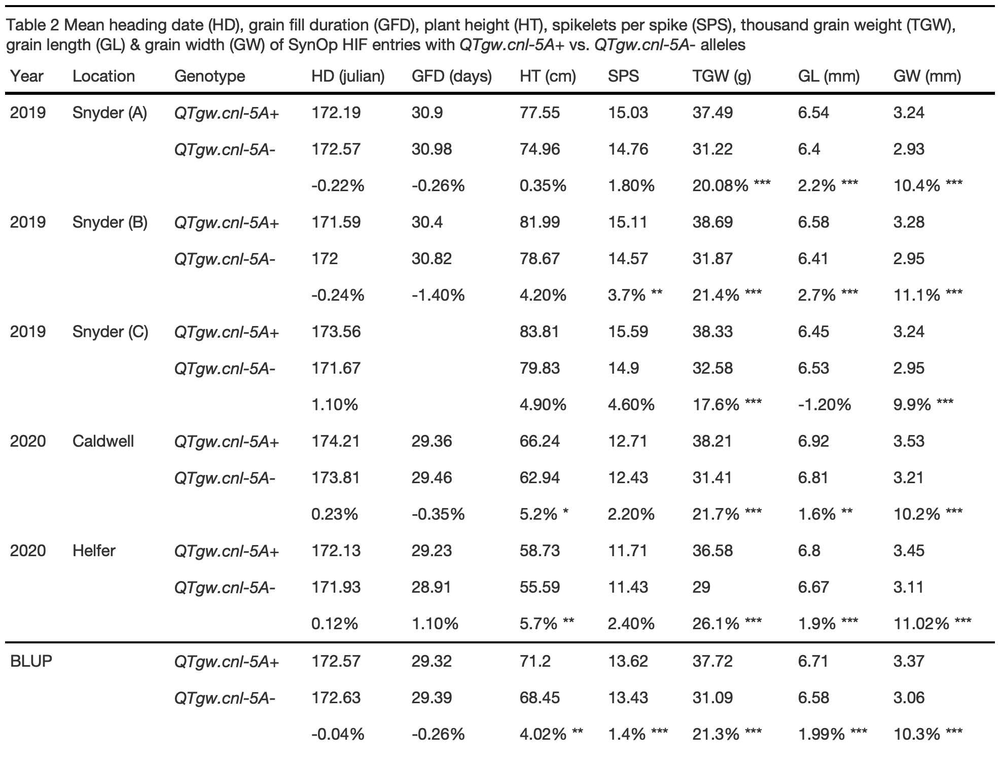
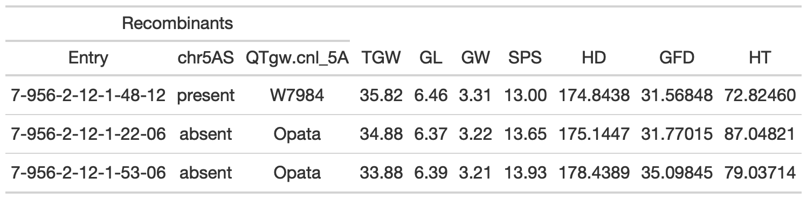
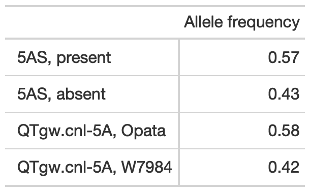
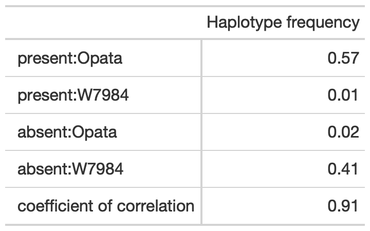

script\_S2: HIF analysis
================

All packages, data, and statistical analysis for reproducing SynOp HIF
population results reported in Taagen et al. 2021. Please see
`script_S2.Rmd` for full R script.

**Load packages**

``` r
library(tidyverse) # R/tidyverse version 1.3.0
library(lme4) #R/lme4 package version 1.1-21
library(knitr) # R/knitr package version 1.28 
library(rlang) #R/rlang package version 0.4.5
library(ggpubr) #R/ggpubr package version 0.4.0
library(emmeans) # R/emmeans package version 1.4.6
library(car) # R/car package version 3.0-10
library(gt) #R/gt version 0.2.2
library(rstatix) # R/rstatix package version 0.6.0
library(inauguration) #R/inauguration version 0.0.0.90
```

### SynOp HIF BLUP phenotypes

A 129-entry inbred subset of SynOp HIF entries and four checks (W7984,
Opata, Tom and Glenn) were were selected and grown in randomized
headrows. There are three site-year combinations (2019 Snyder, 2020
Caldwell, 2020 Helfer), with up to five replicates per entry, across
2019 and 2020 in Ithaca, NY (up to 3 rep at Snyder, 1 rep Caldwell, 1
rep Helfer). Univariate linear models with random environment and
genotype effects were fitted with the `R/lme4` package to obtain best
linear unbiased predictions (BLUPs) for `TGW`, `GL`, `GW`, `SPS`, `HD`,
`GFD`, and `HT` phenotypes across the three environments.

**Load data**

``` r
SynOpHIF_Phenotypes <- read_csv("https://raw.githubusercontent.com/etaagen/Taagen_2021_TPG/main/supplementary_2/file_S2.1.csv", na = "")
SynOpHIF_Phenotypes$SynOpHIF = as.factor(SynOpHIF_Phenotypes$SynOpHIF)
SynOpHIF_Phenotypes$Entry = as.factor(SynOpHIF_Phenotypes$Entry)
SynOpHIF_Phenotypes$Year = as.factor(SynOpHIF_Phenotypes$Year)
SynOpHIF_Phenotypes$Location = as.factor(SynOpHIF_Phenotypes$Location)
SynOpHIF_Phenotypes$Rep = as.factor(SynOpHIF_Phenotypes$Rep)
SynOpHIF_Phenotypes$chr5AS_consensus = as.factor(SynOpHIF_Phenotypes$chr5AS_consensus)
SynOpHIF_Phenotypes$KASP_341510829 = as.factor(SynOpHIF_Phenotypes$KASP_341510829)
```

**TGW**

<!-- -->

**GL**

<!-- -->

**GW**

<!-- -->

**SPS**

    ## boundary (singular) fit: see ?isSingular

<!-- -->

**HD**

<!-- -->

**GFD**

<!-- -->

**HT**

<!-- -->

### Select models, extract BLUPs

The models were selected based on low AIC value, and include the
`SynOpHIF` classification variable.

  - `TGW ~ (1|Entry) + (1|Rep) + SynOpHIF`

  - `GL ~ (1|Entry) + (1|Rep) + 1|SynOpHIF`

  - `GW ~ (1|Entry) + (1|Rep) + 1|SynOpHIF`

  - `SPS ~ (1|Entry) + (1|Rep) + SynOpHIF + HD`

  - `HD ~ (1|Entry) + (1|Rep) + SynOpHIF + HT`

  - `GFD ~ (1|Entry) + (1|Rep) + SynOpHIF + HD`

  - `HT ~ (1|Entry) + (1|Rep) + SynOpHIF + HD`

**and later,** `phenotype ~ (1|Entry) + (1|Rep) + SynOpHIF +
chr5AS_consensus` for testing 5AS significance after Gutierrez-Gonzalez
et al. 2019 published genome sequence that indicated chr 5AS structural
variation.

**Extract random effects from univariate mixed linear models for entries
(obtain BLUPs):**

``` r
BLUP_TGW <- ranef(TGW_model2)$Entry 
BLUP_GL <- ranef(GL_model2)$Entry 
BLUP_GW <- ranef(GW_model2)$Entry 
BLUP_SPS <- ranef(SPS_model3)$Entry 
BLUP_HD <- ranef(HD_model3)$Entry 
BLUP_GFD <- ranef(HD_model3)$Entry 
BLUP_HT <- ranef(HT_model3)$Entry 
```

**Phenotype means, add to BLUP for scaled phenotype value:**

``` r
TGW_mean <- mean(SynOpHIF_Phenotypes$TGW, na.rm = TRUE) 
BLUP_TGW <- BLUP_TGW + TGW_mean
names(BLUP_TGW)[1] <- "BLUP_TGW"
BLUP_TGW <- BLUP_TGW %>% 
  rownames_to_column(var = "entry")

GL_mean <- mean(SynOpHIF_Phenotypes$GL, na.rm = TRUE)
BLUP_GL <- BLUP_GL + GL_mean
names(BLUP_GL)[1] <- "BLUP_GL"
BLUP_GL <- BLUP_GL %>% 
  rownames_to_column(var = "entry")

GW_mean <- mean(SynOpHIF_Phenotypes$GW, na.rm = TRUE)
BLUP_GW <- BLUP_GW + GW_mean
names(BLUP_GW)[1] <- "BLUP_GW"
BLUP_GW <- BLUP_GW %>% 
  rownames_to_column(var = "entry")

SPS_mean <- mean(SynOpHIF_Phenotypes$SPS, na.rm = TRUE)
BLUP_SPS <- BLUP_SPS + SPS_mean
names(BLUP_SPS)[1] <- "BLUP_SPS"
BLUP_SPS <- BLUP_SPS %>% 
  rownames_to_column(var = "entry")

HD_mean <- mean(SynOpHIF_Phenotypes$HD, na.rm = TRUE)
BLUP_HD <- BLUP_HD + HD_mean
names(BLUP_HD)[1] <- "BLUP_HD"
BLUP_HD <- BLUP_HD %>% 
  rownames_to_column(var = "entry")

GFD_mean <- mean(SynOpHIF_Phenotypes$GFD, na.rm = TRUE)
BLUP_GFD <- BLUP_GFD + GFD_mean
names(BLUP_GFD)[1] <- "BLUP_GFD"
BLUP_GFD <- BLUP_GFD %>% 
  rownames_to_column(var = "entry")

HT_mean <- mean(SynOpHIF_Phenotypes$HT, na.rm = TRUE)
BLUP_HT <- BLUP_HT + HT_mean
names(BLUP_HT)[1] <- "BLUP_HT"
BLUP_HT <- BLUP_HT %>% 
  rownames_to_column(var = "entry")
```

**Create csv files**  
*eval = FALSE,can be found in GitHub repository, `file_S2.9.csv`*

``` r
SynOpHIF_BLUP <- BLUP_TGW %>% 
  inner_join(BLUP_GL, by=c("entry")) %>% 
  inner_join(BLUP_GW, by=c("entry")) %>% 
  inner_join(BLUP_SPS, by=c("entry")) %>% 
  inner_join(BLUP_HD, by=c("entry")) %>% 
  inner_join(BLUP_GFD, by=c("entry")) %>% 
  inner_join(BLUP_HT, by=c("entry")) 

#write.csv(SynOpHIF_BLUP, "SynOpHIF_BLUP.csv") 
```

### Phenotypes across years, Table 2

``` r
sny19a <- SynOpHIF_Phenotypes %>% 
  filter(Rep == "A") 
summary(aov(HD ~ KASP_341510829, data = sny19a))
```

    ##                 Df Sum Sq Mean Sq F value Pr(>F)
    ## KASP_341510829   1    4.7   4.712   0.527  0.469
    ## Residuals      127 1134.6   8.934

``` r
summary(aov(GFD ~ KASP_341510829, data = sny19a))
```

    ##                Df Sum Sq Mean Sq F value Pr(>F)
    ## KASP_341510829  1  0.014  0.0142   0.021  0.889
    ## Residuals       7  4.748  0.6783               
    ## 120 observations deleted due to missingness

``` r
summary(aov(HT ~ KASP_341510829, data = sny19a))
```

    ##                 Df Sum Sq Mean Sq F value Pr(>F)  
    ## KASP_341510829   1    210  209.59   3.531 0.0625 .
    ## Residuals      126   7478   59.35                 
    ## ---
    ## Signif. codes:  0 '***' 0.001 '**' 0.01 '*' 0.05 '.' 0.1 ' ' 1
    ## 1 observation deleted due to missingness

``` r
summary(aov(SPS ~ KASP_341510829, data = sny19a))
```

    ##                 Df Sum Sq Mean Sq F value Pr(>F)
    ## KASP_341510829   1   2.27  2.2674   2.577  0.111
    ## Residuals      127 111.74  0.8799

``` r
summary(aov(TGW ~ KASP_341510829, data = sny19a))
```

    ##                 Df Sum Sq Mean Sq F value Pr(>F)    
    ## KASP_341510829   1 1233.9  1233.9   237.2 <2e-16 ***
    ## Residuals      127  660.5     5.2                   
    ## ---
    ## Signif. codes:  0 '***' 0.001 '**' 0.01 '*' 0.05 '.' 0.1 ' ' 1

``` r
summary(aov(GL ~ KASP_341510829, data = sny19a))
```

    ##                 Df Sum Sq Mean Sq F value Pr(>F)    
    ## KASP_341510829   1  0.605  0.6054   14.67  2e-04 ***
    ## Residuals      127  5.241  0.0413                   
    ## ---
    ## Signif. codes:  0 '***' 0.001 '**' 0.01 '*' 0.05 '.' 0.1 ' ' 1

``` r
summary(aov(GW ~ KASP_341510829, data = sny19a)) 
```

    ##                 Df Sum Sq Mean Sq F value Pr(>F)    
    ## KASP_341510829   1 2.8975  2.8975   396.8 <2e-16 ***
    ## Residuals      127 0.9273  0.0073                   
    ## ---
    ## Signif. codes:  0 '***' 0.001 '**' 0.01 '*' 0.05 '.' 0.1 ' ' 1

``` r
sny19b <- SynOpHIF_Phenotypes %>% 
  filter(Rep == "B") 
summary(aov(HD ~ KASP_341510829, data = sny19b))
```

    ##                 Df Sum Sq Mean Sq F value Pr(>F)
    ## KASP_341510829   1    4.6   4.591    0.56  0.456
    ## Residuals      111  910.5   8.202               
    ## 16 observations deleted due to missingness

``` r
summary(aov(GFD ~ KASP_341510829, data = sny19b))
```

    ##                Df Sum Sq Mean Sq F value Pr(>F)
    ## KASP_341510829  1  0.392   0.392   0.778  0.407
    ## Residuals       7  3.528   0.504               
    ## 120 observations deleted due to missingness

``` r
summary(aov(HT ~ KASP_341510829, data = sny19b))
```

    ##                 Df Sum Sq Mean Sq F value Pr(>F)  
    ## KASP_341510829   1    298  298.24   3.739 0.0557 .
    ## Residuals      111   8853   79.76                 
    ## ---
    ## Signif. codes:  0 '***' 0.001 '**' 0.01 '*' 0.05 '.' 0.1 ' ' 1
    ## 16 observations deleted due to missingness

``` r
summary(aov(SPS ~ KASP_341510829, data = sny19b))
```

    ##                 Df Sum Sq Mean Sq F value  Pr(>F)   
    ## KASP_341510829   1   7.68    7.68   7.604 0.00681 **
    ## Residuals      111 112.11    1.01                   
    ## ---
    ## Signif. codes:  0 '***' 0.001 '**' 0.01 '*' 0.05 '.' 0.1 ' ' 1
    ## 16 observations deleted due to missingness

``` r
summary(aov(TGW ~ KASP_341510829, data = sny19b))
```

    ##                 Df Sum Sq Mean Sq F value Pr(>F)    
    ## KASP_341510829   1   1259    1259   209.2 <2e-16 ***
    ## Residuals      111    668       6                   
    ## ---
    ## Signif. codes:  0 '***' 0.001 '**' 0.01 '*' 0.05 '.' 0.1 ' ' 1
    ## 16 observations deleted due to missingness

``` r
summary(aov(GL ~ KASP_341510829, data = sny19b))
```

    ##                 Df Sum Sq Mean Sq F value   Pr(>F)    
    ## KASP_341510829   1  0.796  0.7964      17 7.23e-05 ***
    ## Residuals      111  5.199  0.0468                     
    ## ---
    ## Signif. codes:  0 '***' 0.001 '**' 0.01 '*' 0.05 '.' 0.1 ' ' 1
    ## 16 observations deleted due to missingness

``` r
summary(aov(GW ~ KASP_341510829, data = sny19b))
```

    ##                 Df Sum Sq Mean Sq F value Pr(>F)    
    ## KASP_341510829   1 2.8961  2.8961   408.4 <2e-16 ***
    ## Residuals      111 0.7871  0.0071                   
    ## ---
    ## Signif. codes:  0 '***' 0.001 '**' 0.01 '*' 0.05 '.' 0.1 ' ' 1
    ## 16 observations deleted due to missingness

``` r
sny19c <- SynOpHIF_Phenotypes %>% 
  filter(Rep == "C") 
summary(aov(HD ~ KASP_341510829, data = sny19c))
```

    ##                Df Sum Sq Mean Sq F value Pr(>F)
    ## KASP_341510829  1  15.68  15.684   2.101  0.163
    ## Residuals      20 149.27   7.464               
    ## 107 observations deleted due to missingness

``` r
summary(aov(HT ~ KASP_341510829, data = sny19c))
```

    ##                Df Sum Sq Mean Sq F value Pr(>F)
    ## KASP_341510829  1   69.1   69.09   0.595  0.449
    ## Residuals      20 2321.3  116.06               
    ## 107 observations deleted due to missingness

``` r
summary(aov(SPS ~ KASP_341510829, data = sny19c))
```

    ##                Df Sum Sq Mean Sq F value Pr(>F)
    ## KASP_341510829  1  2.063   2.062    1.49  0.236
    ## Residuals      20 27.678   1.384               
    ## 107 observations deleted due to missingness

``` r
summary(aov(TGW ~ KASP_341510829, data = sny19c))
```

    ##                Df Sum Sq Mean Sq F value   Pr(>F)    
    ## KASP_341510829  1  144.0  143.96   28.42 3.23e-05 ***
    ## Residuals      20  101.3    5.07                     
    ## ---
    ## Signif. codes:  0 '***' 0.001 '**' 0.01 '*' 0.05 '.' 0.1 ' ' 1
    ## 107 observations deleted due to missingness

``` r
summary(aov(GL ~ KASP_341510829, data = sny19c))
```

    ##                Df Sum Sq Mean Sq F value Pr(>F)
    ## KASP_341510829  1 0.0258 0.02583    0.66  0.426
    ## Residuals      20 0.7833 0.03917               
    ## 107 observations deleted due to missingness

``` r
summary(aov(GW ~ KASP_341510829, data = sny19c))
```

    ##                Df Sum Sq Mean Sq F value   Pr(>F)    
    ## KASP_341510829  1 0.3750  0.3750   67.45 7.75e-08 ***
    ## Residuals      20 0.1112  0.0056                     
    ## ---
    ## Signif. codes:  0 '***' 0.001 '**' 0.01 '*' 0.05 '.' 0.1 ' ' 1
    ## 107 observations deleted due to missingness

``` r
cald20 <- SynOpHIF_Phenotypes %>% 
  filter(Rep == "D") 
summary(aov(HD ~ KASP_341510829, data = cald20))
```

    ##                 Df Sum Sq Mean Sq F value Pr(>F)
    ## KASP_341510829   1    5.0   4.986   0.826  0.365
    ## Residuals      127  766.7   6.037

``` r
summary(aov(GFD ~ KASP_341510829, data = cald20))
```

    ##                 Df Sum Sq Mean Sq F value Pr(>F)
    ## KASP_341510829   1    0.3   0.333   0.091  0.763
    ## Residuals      127  464.7   3.659

``` r
summary(aov(HT ~ KASP_341510829, data = cald20))
```

    ##                 Df Sum Sq Mean Sq F value Pr(>F)  
    ## KASP_341510829   1    341     341   5.777 0.0177 *
    ## Residuals      127   7497      59                 
    ## ---
    ## Signif. codes:  0 '***' 0.001 '**' 0.01 '*' 0.05 '.' 0.1 ' ' 1

``` r
summary(aov(SPS ~ KASP_341510829, data = cald20))
```

    ##                 Df Sum Sq Mean Sq F value Pr(>F)  
    ## KASP_341510829   1   2.44  2.4380   3.389  0.068 .
    ## Residuals      127  91.36  0.7194                 
    ## ---
    ## Signif. codes:  0 '***' 0.001 '**' 0.01 '*' 0.05 '.' 0.1 ' ' 1

``` r
summary(aov(TGW ~ KASP_341510829, data = cald20))
```

    ##                 Df Sum Sq Mean Sq F value Pr(>F)    
    ## KASP_341510829   1 1452.9    1453   240.5 <2e-16 ***
    ## Residuals      127  767.3       6                   
    ## ---
    ## Signif. codes:  0 '***' 0.001 '**' 0.01 '*' 0.05 '.' 0.1 ' ' 1

``` r
summary(aov(GL ~ KASP_341510829, data = cald20))
```

    ##                 Df Sum Sq Mean Sq F value Pr(>F)   
    ## KASP_341510829   1  0.363  0.3629   7.942 0.0056 **
    ## Residuals      127  5.803  0.0457                  
    ## ---
    ## Signif. codes:  0 '***' 0.001 '**' 0.01 '*' 0.05 '.' 0.1 ' ' 1

``` r
summary(aov(GW ~ KASP_341510829, data = cald20))
```

    ##                 Df Sum Sq Mean Sq F value Pr(>F)    
    ## KASP_341510829   1  3.361   3.361   383.8 <2e-16 ***
    ## Residuals      127  1.112   0.009                   
    ## ---
    ## Signif. codes:  0 '***' 0.001 '**' 0.01 '*' 0.05 '.' 0.1 ' ' 1

``` r
helf20 <- SynOpHIF_Phenotypes %>% 
  filter(Rep == "E") 
summary(aov(HD ~ KASP_341510829, data = helf20))
```

    ##                 Df Sum Sq Mean Sq F value Pr(>F)
    ## KASP_341510829   1    1.4   1.351   0.296  0.588
    ## Residuals      127  580.4   4.570

``` r
summary(aov(GFD ~ KASP_341510829, data = helf20))
```

    ##                 Df Sum Sq Mean Sq F value Pr(>F)
    ## KASP_341510829   1    3.2   3.200   1.211  0.273
    ## Residuals      127  335.7   2.643

``` r
summary(aov(HT ~ KASP_341510829, data = helf20))
```

    ##                 Df Sum Sq Mean Sq F value  Pr(>F)   
    ## KASP_341510829   1    310  309.69    8.11 0.00514 **
    ## Residuals      127   4850   38.19                   
    ## ---
    ## Signif. codes:  0 '***' 0.001 '**' 0.01 '*' 0.05 '.' 0.1 ' ' 1

``` r
summary(aov(SPS ~ KASP_341510829, data = helf20))
```

    ##                 Df Sum Sq Mean Sq F value Pr(>F)  
    ## KASP_341510829   1   2.38  2.3775   3.045 0.0834 .
    ## Residuals      127  99.16  0.7808                 
    ## ---
    ## Signif. codes:  0 '***' 0.001 '**' 0.01 '*' 0.05 '.' 0.1 ' ' 1

``` r
summary(aov(TGW ~ KASP_341510829, data = helf20))
```

    ##                 Df Sum Sq Mean Sq F value Pr(>F)    
    ## KASP_341510829   1 1801.1  1801.1   351.9 <2e-16 ***
    ## Residuals      127  650.1     5.1                   
    ## ---
    ## Signif. codes:  0 '***' 0.001 '**' 0.01 '*' 0.05 '.' 0.1 ' ' 1

``` r
summary(aov(GL ~ KASP_341510829, data = helf20))
```

    ##                 Df Sum Sq Mean Sq F value   Pr(>F)    
    ## KASP_341510829   1  0.533  0.5334   13.14 0.000418 ***
    ## Residuals      127  5.157  0.0406                     
    ## ---
    ## Signif. codes:  0 '***' 0.001 '**' 0.01 '*' 0.05 '.' 0.1 ' ' 1

``` r
summary(aov(GW ~ KASP_341510829, data = helf20))  
```

    ##                 Df Sum Sq Mean Sq F value Pr(>F)    
    ## KASP_341510829   1  3.691   3.691   531.3 <2e-16 ***
    ## Residuals      127  0.882   0.007                   
    ## ---
    ## Signif. codes:  0 '***' 0.001 '**' 0.01 '*' 0.05 '.' 0.1 ' ' 1

``` r
blup_pheno <- read_csv("https://raw.githubusercontent.com/etaagen/Taagen_2021_TPG/main/supplementary_2/file_S2.4.csv", na = "NA")
summary(aov(HD_BLUP ~ KASP_341510829, data = blup_pheno))
```

    ##                 Df Sum Sq Mean Sq F value Pr(>F)
    ## KASP_341510829   1    0.1   0.126   0.023   0.88
    ## Residuals      127  694.1   5.465

``` r
summary(aov(GFD_BLUP ~ KASP_341510829, data = blup_pheno))
```

    ##                 Df Sum Sq Mean Sq F value Pr(>F)
    ## KASP_341510829   1    0.2   0.188   0.035  0.852
    ## Residuals      127  681.2   5.364

``` r
summary(aov(HT_BLUP ~ KASP_341510829, data = blup_pheno))
```

    ##                 Df Sum Sq Mean Sq F value Pr(>F)   
    ## KASP_341510829   1  238.1  238.07   9.857 0.0021 **
    ## Residuals      127 3067.3   24.15                  
    ## ---
    ## Signif. codes:  0 '***' 0.001 '**' 0.01 '*' 0.05 '.' 0.1 ' ' 1

``` r
summary(aov(SPS_BLUP ~ KASP_341510829, data = blup_pheno))
```

    ##                 Df Sum Sq Mean Sq F value   Pr(>F)    
    ## KASP_341510829   1  1.142  1.1423    12.4 0.000597 ***
    ## Residuals      127 11.700  0.0921                     
    ## ---
    ## Signif. codes:  0 '***' 0.001 '**' 0.01 '*' 0.05 '.' 0.1 ' ' 1

``` r
summary(aov(TGW_BLUP ~ KASP_341510829, data = blup_pheno))
```

    ##                 Df Sum Sq Mean Sq F value Pr(>F)    
    ## KASP_341510829   1   1378  1377.9   364.6 <2e-16 ***
    ## Residuals      127    480     3.8                   
    ## ---
    ## Signif. codes:  0 '***' 0.001 '**' 0.01 '*' 0.05 '.' 0.1 ' ' 1

``` r
summary(aov(GL_BLUP ~ KASP_341510829, data = blup_pheno))
```

    ##                 Df Sum Sq Mean Sq F value   Pr(>F)    
    ## KASP_341510829   1  0.538  0.5378   14.23 0.000247 ***
    ## Residuals      127  4.801  0.0378                     
    ## ---
    ## Signif. codes:  0 '***' 0.001 '**' 0.01 '*' 0.05 '.' 0.1 ' ' 1

``` r
summary(aov(GW_BLUP ~ KASP_341510829, data = blup_pheno))  
```

    ##                 Df Sum Sq Mean Sq F value Pr(>F)    
    ## KASP_341510829   1 3.1353  3.1353   703.4 <2e-16 ***
    ## Residuals      127 0.5661  0.0045                   
    ## ---
    ## Signif. codes:  0 '***' 0.001 '**' 0.01 '*' 0.05 '.' 0.1 ' ' 1

<!-- -->

### KASP marker sequence order comparison with 10 + Genome Project

Each color represents SNP BLAST position across 12 genomes. See
`file_S2.6` for marker names.  
<!-- -->

### Fine-mapping figures

The 129 entry fine-mapping population can be subset into crossover
groups based on shared recombination intervals between SNPs and
comparisons across BLUP phenotypes. Please see `HIF_groups.xlsx` for
entries in each group (n = \# of entries per group).  
<!-- --><!-- --><!-- --><!-- --><!-- --><!-- --><!-- -->

### Fine-mapping T.test

T.test comparisons for each group vs QTgw.cnl-5A+ or QTgw.cnl-5A- (based
on like-phenotype)

``` r
# QTgw.cnl-5A+ vs QTgw.cnl-5A-
groupOW <- HIFttest %>% 
  filter(Group== "QTgw.cnl-5A+" | Group== "QTgw.cnl-5A-")
t.test(TGW_BLUP ~ Group, data = groupOW)
```

    ## 
    ##  Welch Two Sample t-test
    ## 
    ## data:  TGW_BLUP by Group
    ## t = -8.9069, df = 17.025, p-value = 8.115e-08
    ## alternative hypothesis: true difference in means is not equal to 0
    ## 95 percent confidence interval:
    ##  -9.707662 -5.989752
    ## sample estimates:
    ## mean in group QTgw.cnl-5A- mean in group QTgw.cnl-5A+ 
    ##                   31.94549                   39.79420

``` r
t.test(GW_BLUP ~ Group, data = groupOW)
```

    ## 
    ##  Welch Two Sample t-test
    ## 
    ## data:  GW_BLUP by Group
    ## t = -17.049, df = 16.249, p-value = 8.552e-12
    ## alternative hypothesis: true difference in means is not equal to 0
    ## 95 percent confidence interval:
    ##  -0.3666273 -0.2856254
    ## sample estimates:
    ## mean in group QTgw.cnl-5A- mean in group QTgw.cnl-5A+ 
    ##                   3.068392                   3.394519

``` r
# Group 1 vs QTgw.cnl-5A- 
groupW1 <- HIFttest %>% 
  filter(Group== "QTgw.cnl-5A-" | Group== "1")
t.test(TGW_BLUP ~ Group, data = groupW1)
```

    ## 
    ##  Welch Two Sample t-test
    ## 
    ## data:  TGW_BLUP by Group
    ## t = 7.5591, df = 13.992, p-value = 2.642e-06
    ## alternative hypothesis: true difference in means is not equal to 0
    ## 95 percent confidence interval:
    ##  3.701614 6.634486
    ## sample estimates:
    ##            mean in group 1 mean in group QTgw.cnl-5A- 
    ##                   37.11354                   31.94549

``` r
t.test(GW_BLUP ~ Group, data = groupW1)
```

    ## 
    ##  Welch Two Sample t-test
    ## 
    ## data:  GW_BLUP by Group
    ## t = 10.45, df = 9.5294, p-value = 1.572e-06
    ## alternative hypothesis: true difference in means is not equal to 0
    ## 95 percent confidence interval:
    ##  0.2091497 0.3234885
    ## sample estimates:
    ##            mean in group 1 mean in group QTgw.cnl-5A- 
    ##                   3.334711                   3.068392

``` r
# Group 2 vs QTgw.cnl-5A- 
groupW2 <- HIFttest %>% 
  filter(Group== "QTgw.cnl-5A-" | Group== "2")
t.test(TGW_BLUP ~ Group, data = groupW2)
```

    ## 
    ##  Welch Two Sample t-test
    ## 
    ## data:  TGW_BLUP by Group
    ## t = 8.1949, df = 21.935, p-value = 4.037e-08
    ## alternative hypothesis: true difference in means is not equal to 0
    ## 95 percent confidence interval:
    ##  5.450728 9.145094
    ## sample estimates:
    ##            mean in group 2 mean in group QTgw.cnl-5A- 
    ##                   39.24341                   31.94549

``` r
t.test(GW_BLUP ~ Group, data = groupW2)
```

    ## 
    ##  Welch Two Sample t-test
    ## 
    ## data:  GW_BLUP by Group
    ## t = 13.516, df = 21.575, p-value = 5.264e-12
    ## alternative hypothesis: true difference in means is not equal to 0
    ## 95 percent confidence interval:
    ##  0.2991149 0.4076936
    ## sample estimates:
    ##            mean in group 2 mean in group QTgw.cnl-5A- 
    ##                   3.421796                   3.068392

``` r
# Group 3 vs QTgw.cnl-5A- 
groupW3 <- HIFttest %>% 
  filter(Group== "QTgw.cnl-5A-" | Group== "3")
t.test(TGW_BLUP ~ Group, data = groupW3)
```

    ## 
    ##  Welch Two Sample t-test
    ## 
    ## data:  TGW_BLUP by Group
    ## t = 6.8496, df = 15.835, p-value = 4.129e-06
    ## alternative hypothesis: true difference in means is not equal to 0
    ## 95 percent confidence interval:
    ##  3.352132 6.360747
    ## sample estimates:
    ##            mean in group 3 mean in group QTgw.cnl-5A- 
    ##                   36.80193                   31.94549

``` r
t.test(GW_BLUP ~ Group, data = groupW3)
```

    ## 
    ##  Welch Two Sample t-test
    ## 
    ## data:  GW_BLUP by Group
    ## t = 13.696, df = 15.332, p-value = 5.226e-10
    ## alternative hypothesis: true difference in means is not equal to 0
    ## 95 percent confidence interval:
    ##  0.2591649 0.3544878
    ## sample estimates:
    ##            mean in group 3 mean in group QTgw.cnl-5A- 
    ##                   3.375219                   3.068392

``` r
# Group 4 vs QTgw.cnl-5A- 
groupW4 <- HIFttest %>% 
  filter(Group== "QTgw.cnl-5A-" | Group== "4")
t.test(TGW_BLUP ~ Group, data = groupW4)
```

    ## 
    ##  Welch Two Sample t-test
    ## 
    ## data:  TGW_BLUP by Group
    ## t = 7.4092, df = 13.322, p-value = 4.438e-06
    ## alternative hypothesis: true difference in means is not equal to 0
    ## 95 percent confidence interval:
    ##  3.298079 6.003628
    ## sample estimates:
    ##            mean in group 4 mean in group QTgw.cnl-5A- 
    ##                   36.59635                   31.94549

``` r
t.test(GW_BLUP ~ Group, data = groupW4)
```

    ## 
    ##  Welch Two Sample t-test
    ## 
    ## data:  GW_BLUP by Group
    ## t = 17.078, df = 16.784, p-value = 4.832e-12
    ## alternative hypothesis: true difference in means is not equal to 0
    ## 95 percent confidence interval:
    ##  0.2801755 0.3592497
    ## sample estimates:
    ##            mean in group 4 mean in group QTgw.cnl-5A- 
    ##                   3.388105                   3.068392

``` r
# Group 5 vs QTgw.cnl-5A+ 
groupW5 <- HIFttest %>% 
  filter(Group== "QTgw.cnl-5A+" | Group== "5")
t.test(TGW_BLUP ~ Group, data = groupW5)
```

    ## 
    ##  Welch Two Sample t-test
    ## 
    ## data:  TGW_BLUP by Group
    ## t = -6.9868, df = 6.7158, p-value = 0.0002588
    ## alternative hypothesis: true difference in means is not equal to 0
    ## 95 percent confidence interval:
    ##  -10.169138  -4.993218
    ## sample estimates:
    ##            mean in group 5 mean in group QTgw.cnl-5A+ 
    ##                   32.21302                   39.79420

``` r
t.test(GW_BLUP ~ Group, data = groupW5)
```

    ## 
    ##  Welch Two Sample t-test
    ## 
    ## data:  GW_BLUP by Group
    ## t = -11.984, df = 4.0802, p-value = 0.000248
    ## alternative hypothesis: true difference in means is not equal to 0
    ## 95 percent confidence interval:
    ##  -0.3896484 -0.2439826
    ## sample estimates:
    ##            mean in group 5 mean in group QTgw.cnl-5A+ 
    ##                   3.077703                   3.394519

``` r
# Group 6 vs QTgw.cnl-5A+ 
groupW6 <- HIFttest %>% 
  filter(Group== "QTgw.cnl-5A+" | Group== "6")
t.test(TGW_BLUP ~ Group, data = groupW6)
```

    ## 
    ##  Welch Two Sample t-test
    ## 
    ## data:  TGW_BLUP by Group
    ## t = -12.777, df = 9.3638, p-value = 3.082e-07
    ## alternative hypothesis: true difference in means is not equal to 0
    ## 95 percent confidence interval:
    ##  -10.345462  -7.248864
    ## sample estimates:
    ##            mean in group 6 mean in group QTgw.cnl-5A+ 
    ##                   30.99704                   39.79420

``` r
t.test(GW_BLUP ~ Group, data = groupW6)
```

    ## 
    ##  Welch Two Sample t-test
    ## 
    ## data:  GW_BLUP by Group
    ## t = -26.296, df = 15.192, p-value = 4.373e-14
    ## alternative hypothesis: true difference in means is not equal to 0
    ## 95 percent confidence interval:
    ##  -0.3454447 -0.2936962
    ## sample estimates:
    ##            mean in group 6 mean in group QTgw.cnl-5A+ 
    ##                   3.074948                   3.394519

``` r
# Group 7 vs QTgw.cnl-5A+ 
groupW7 <- HIFttest %>% 
  filter(Group== "QTgw.cnl-5A+" | Group== "7")
t.test(TGW_BLUP ~ Group, data = groupW7)
```

    ## 
    ##  Welch Two Sample t-test
    ## 
    ## data:  TGW_BLUP by Group
    ## t = -5.2155, df = 4.3129, p-value = 0.00523
    ## alternative hypothesis: true difference in means is not equal to 0
    ## 95 percent confidence interval:
    ##  -12.595603  -4.005415
    ## sample estimates:
    ##            mean in group 7 mean in group QTgw.cnl-5A+ 
    ##                   31.49369                   39.79420

``` r
t.test(GW_BLUP ~ Group, data = groupW7)
```

    ## 
    ##  Welch Two Sample t-test
    ## 
    ## data:  GW_BLUP by Group
    ## t = -4.1153, df = 3.1078, p-value = 0.02428
    ## alternative hypothesis: true difference in means is not equal to 0
    ## 95 percent confidence interval:
    ##  -0.55419207 -0.07615811
    ## sample estimates:
    ##            mean in group 7 mean in group QTgw.cnl-5A+ 
    ##                   3.079344                   3.394519

``` r
# Group 8 vs QTgw.cnl-5A+ 
groupW8 <- HIFttest %>% 
  filter(Group== "QTgw.cnl-5A+" | Group== "8")
t.test(TGW_BLUP ~ Group, data = groupW8)
```

    ## 
    ##  Welch Two Sample t-test
    ## 
    ## data:  TGW_BLUP by Group
    ## t = -10.026, df = 18.578, p-value = 6.303e-09
    ## alternative hypothesis: true difference in means is not equal to 0
    ## 95 percent confidence interval:
    ##  -11.38996  -7.45059
    ## sample estimates:
    ##            mean in group 8 mean in group QTgw.cnl-5A+ 
    ##                   30.37393                   39.79420

``` r
t.test(GW_BLUP ~ Group, data = groupW8)
```

    ## 
    ##  Welch Two Sample t-test
    ## 
    ## data:  GW_BLUP by Group
    ## t = -16.289, df = 15.748, p-value = 2.833e-11
    ## alternative hypothesis: true difference in means is not equal to 0
    ## 95 percent confidence interval:
    ##  -0.4211959 -0.3240785
    ## sample estimates:
    ##            mean in group 8 mean in group QTgw.cnl-5A+ 
    ##                   3.021881                   3.394519

``` r
# Group 9 vs QTgw.cnl-5A+ 
groupW9 <- HIFttest %>% 
  filter(Group== "QTgw.cnl-5A+" | Group== "9")
t.test(TGW_BLUP ~ Group, data = groupW9)
```

    ## 
    ##  Welch Two Sample t-test
    ## 
    ## data:  TGW_BLUP by Group
    ## t = -17.08, df = 8.9059, p-value = 4.117e-08
    ## alternative hypothesis: true difference in means is not equal to 0
    ## 95 percent confidence interval:
    ##  -13.33152 -10.20870
    ## sample estimates:
    ##            mean in group 9 mean in group QTgw.cnl-5A+ 
    ##                   28.02409                   39.79420

``` r
t.test(GW_BLUP ~ Group, data = groupW9)
```

    ## 
    ##  Welch Two Sample t-test
    ## 
    ## data:  GW_BLUP by Group
    ## t = -45.502, df = 8.2811, p-value = 3.122e-11
    ## alternative hypothesis: true difference in means is not equal to 0
    ## 95 percent confidence interval:
    ##  -0.4894586 -0.4425051
    ## sample estimates:
    ##            mean in group 9 mean in group QTgw.cnl-5A+ 
    ##                   2.928537                   3.394519

``` r
# Group 10 vs QTgw.cnl-5A- 
groupW10 <- HIFttest %>% 
  filter(Group== "QTgw.cnl-5A-" | Group== "10")
t.test(TGW_BLUP ~ Group, data = groupW10)
```

    ## 
    ##  Welch Two Sample t-test
    ## 
    ## data:  TGW_BLUP by Group
    ## t = 5.693, df = 10.044, p-value = 0.000197
    ## alternative hypothesis: true difference in means is not equal to 0
    ## 95 percent confidence interval:
    ##  3.075104 7.026322
    ## sample estimates:
    ##           mean in group 10 mean in group QTgw.cnl-5A- 
    ##                   36.99621                   31.94549

``` r
t.test(GW_BLUP ~ Group, data = groupW10)
```

    ## 
    ##  Welch Two Sample t-test
    ## 
    ## data:  GW_BLUP by Group
    ## t = 8.2096, df = 7.4779, p-value = 5.338e-05
    ## alternative hypothesis: true difference in means is not equal to 0
    ## 95 percent confidence interval:
    ##  0.1762008 0.3162139
    ## sample estimates:
    ##           mean in group 10 mean in group QTgw.cnl-5A- 
    ##                   3.314600                   3.068392

``` r
# Group 11 too few entries, QTgw.cnl-5A- like phenotype
# Group 12 too few entries, QTgw.cnl-5A+ like phenotype
# Group 13 too few entries, QTgw.cnl-5A- like phenotype
# Group 14 vs QTgw.cnl-5A- 
groupW14 <- HIFttest %>% 
  filter(Group== "QTgw.cnl-5A-" | Group== "14")
t.test(TGW_BLUP ~ Group, data = groupW14)
```

    ## 
    ##  Welch Two Sample t-test
    ## 
    ## data:  TGW_BLUP by Group
    ## t = 7.5367, df = 21.087, p-value = 2.058e-07
    ## alternative hypothesis: true difference in means is not equal to 0
    ## 95 percent confidence interval:
    ##  4.102941 7.228964
    ## sample estimates:
    ##           mean in group 14 mean in group QTgw.cnl-5A- 
    ##                   37.61145                   31.94549

``` r
t.test(GW_BLUP ~ Group, data = groupW14)
```

    ## 
    ##  Welch Two Sample t-test
    ## 
    ## data:  GW_BLUP by Group
    ## t = 9.75, df = 23.797, p-value = 8.757e-10
    ## alternative hypothesis: true difference in means is not equal to 0
    ## 95 percent confidence interval:
    ##  0.2045821 0.3145161
    ## sample estimates:
    ##           mean in group 14 mean in group QTgw.cnl-5A- 
    ##                   3.327941                   3.068392

### Test for interaction between 5AS and QTL

    ## Linear mixed model fit by maximum likelihood  ['lmerMod']
    ## Formula: TGW ~ (1 | Entry) + chr5AS_consensus * KASP_341510829
    ##    Data: SynOpHIF_Phenotypes
    ## 
    ##      AIC      BIC   logLik deviance df.resid 
    ##   2224.0   2249.5  -1106.0   2212.0      516 
    ## 
    ## Scaled residuals: 
    ##     Min      1Q  Median      3Q     Max 
    ## -2.7290 -0.5635  0.0284  0.6078  4.3444 
    ## 
    ## Random effects:
    ##  Groups   Name        Variance Std.Dev.
    ##  Entry    (Intercept) 3.435    1.853   
    ##  Residual             2.564    1.601   
    ## Number of obs: 522, groups:  Entry, 129
    ## 
    ## Fixed effects:
    ##                                             Estimate Std. Error t value
    ## (Intercept)                                   34.194      1.434  23.847
    ## chr5AS_consensuspresent                        3.624      1.453   2.494
    ## KASP_341510829W7984                           -3.441      1.461  -2.356
    ## chr5AS_consensuspresent:KASP_341510829W7984    1.294      2.503   0.517
    ## 
    ## Correlation of Fixed Effects:
    ##             (Intr) ch5AS_ KASP_3
    ## chr5AS_cnsn -0.987              
    ## KASP_341510 -0.982  0.969       
    ## c5AS_:KASP_  0.573 -0.581 -0.584

    ## $emmeans
    ##  chr5AS_consensus KASP_341510829 emmean    SE  df lower.CL upper.CL
    ##  absent           Opata            34.2 1.457 135     31.3     37.1
    ##  present          Opata            37.8 0.240 132     37.3     38.3
    ##  absent           W7984            30.8 0.282 134     30.2     31.3
    ##  present          W7984            35.7 2.051 133     31.6     39.7
    ## 
    ## Degrees-of-freedom method: kenward-roger 
    ## Confidence level used: 0.95 
    ## 
    ## $contrasts
    ##  contrast                      estimate   SE  df t.ratio p.value
    ##  absent Opata - present Opata     -3.62 1.48 135 -2.455  0.0719 
    ##  absent Opata - absent W7984       3.44 1.48 135  2.319  0.0987 
    ##  absent Opata - present W7984     -1.48 2.52 134 -0.587  0.9359 
    ##  present Opata - absent W7984      7.07 0.37 133 19.072  <.0001 
    ##  present Opata - present W7984     2.15 2.07 133  1.040  0.7263 
    ##  absent W7984 - present W7984     -4.92 2.07 133 -2.375  0.0869 
    ## 
    ## Degrees-of-freedom method: kenward-roger 
    ## P value adjustment: tukey method for comparing a family of 4 estimates

<!-- -->

    ## Analysis of Deviance Table (Type II Wald chisquare tests)
    ## 
    ## Response: TGW
    ##                                   Chisq Df Pr(>Chisq)    
    ## chr5AS_consensus                11.7742  1  0.0006006 ***
    ## KASP_341510829                   6.3998  1  0.0114135 *  
    ## chr5AS_consensus:KASP_341510829  0.2672  1  0.6052464    
    ## ---
    ## Signif. codes:  0 '***' 0.001 '**' 0.01 '*' 0.05 '.' 0.1 ' ' 1

### Univariate models to account for chr 5AS in BLUP phenotype

`phenotype ~ (1|Entry) + (1|Rep) + SynOpHIF + chr5AS_consensus`

**Extract random effects from univariate mixed linear models for entries
(obtain BLUPs):**

``` r
BLUP_TGW <- ranef(TGW_model4)$Entry 
BLUP_GL <- ranef(GL_model4)$Entry 
BLUP_GW <- ranef(GW_model4)$Entry 
BLUP_SPS <- ranef(SPS_model4)$Entry 
BLUP_HD <- ranef(HD_model4)$Entry 
BLUP_GFD <- ranef(HD_model4)$Entry 
BLUP_HT <- ranef(HT_model4)$Entry 
```

**Phenotype means, add to BLUP for scaled phenotype value:**

``` r
TGW_mean <- mean(SynOpHIF_Phenotypes$TGW, na.rm = TRUE) 
BLUP_TGW <- BLUP_TGW + TGW_mean
names(BLUP_TGW)[1] <- "BLUP_TGW"
BLUP_TGW <- BLUP_TGW %>% 
  rownames_to_column(var = "entry")

GL_mean <- mean(SynOpHIF_Phenotypes$GL, na.rm = TRUE)
BLUP_GL <- BLUP_GL + GL_mean
names(BLUP_GL)[1] <- "BLUP_GL"
BLUP_GL <- BLUP_GL %>% 
  rownames_to_column(var = "entry")

GW_mean <- mean(SynOpHIF_Phenotypes$GW, na.rm = TRUE)
BLUP_GW <- BLUP_GW + GW_mean
names(BLUP_GW)[1] <- "BLUP_GW"
BLUP_GW <- BLUP_GW %>% 
  rownames_to_column(var = "entry")

SPS_mean <- mean(SynOpHIF_Phenotypes$SPS, na.rm = TRUE)
BLUP_SPS <- BLUP_SPS + SPS_mean
names(BLUP_SPS)[1] <- "BLUP_SPS"
BLUP_SPS <- BLUP_SPS %>% 
  rownames_to_column(var = "entry")

HD_mean <- mean(SynOpHIF_Phenotypes$HD, na.rm = TRUE)
BLUP_HD <- BLUP_HD + HD_mean
names(BLUP_HD)[1] <- "BLUP_HD"
BLUP_HD <- BLUP_HD %>% 
  rownames_to_column(var = "entry")

GFD_mean <- mean(SynOpHIF_Phenotypes$GFD, na.rm = TRUE)
BLUP_GFD <- BLUP_GFD + GFD_mean
names(BLUP_GFD)[1] <- "BLUP_GFD"
BLUP_GFD <- BLUP_GFD %>% 
  rownames_to_column(var = "entry")

HT_mean <- mean(SynOpHIF_Phenotypes$HT, na.rm = TRUE)
BLUP_HT <- BLUP_HT + HT_mean
names(BLUP_HT)[1] <- "BLUP_HT"
BLUP_HT <- BLUP_HT %>% 
  rownames_to_column(var = "entry")
```

**Create csv files**  
*eval = FALSE,can be found in GitHub repository, `file_S2.10.csv`*

``` r
SynOpHIF_BLUP_5AS <- BLUP_TGW %>% 
  inner_join(BLUP_GL, by=c("entry")) %>% 
  inner_join(BLUP_GW, by=c("entry")) %>% 
  inner_join(BLUP_SPS, by=c("entry")) %>% 
  inner_join(BLUP_HD, by=c("entry")) %>% 
  inner_join(BLUP_GFD, by=c("entry")) %>% 
  inner_join(BLUP_HT, by=c("entry")) 

#write.csv(SynOpHIF_BLUP_5AS, "SynOpHIF_BLUP_5AS.csv") 
```

### Chromosome 5AS fixed effect and phenotype distributions

**Figure 4**

<!-- -->

### SynOpHIF chr5AS and QTgw.cnl-5A linkage disequilibrium

<!-- --><!-- --><!-- -->

### T-test: phenotype vs chromosome 5AS presence / absence OR QTL Opata / W7984 allele

<!-- -->
