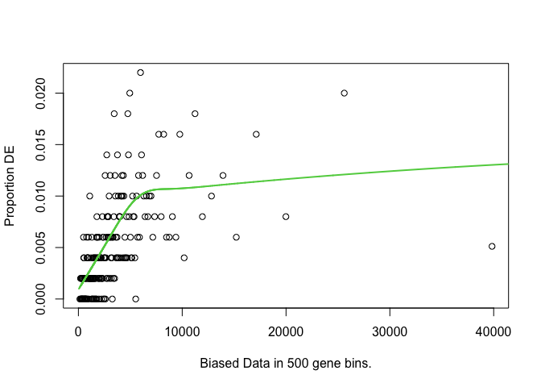
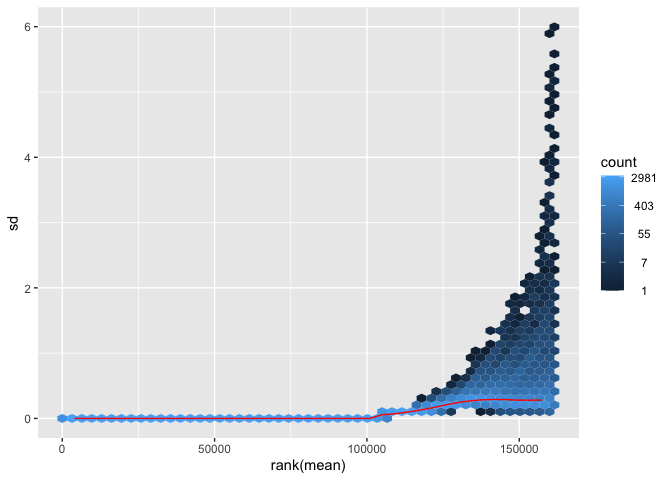
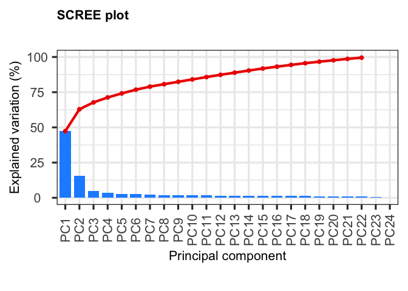
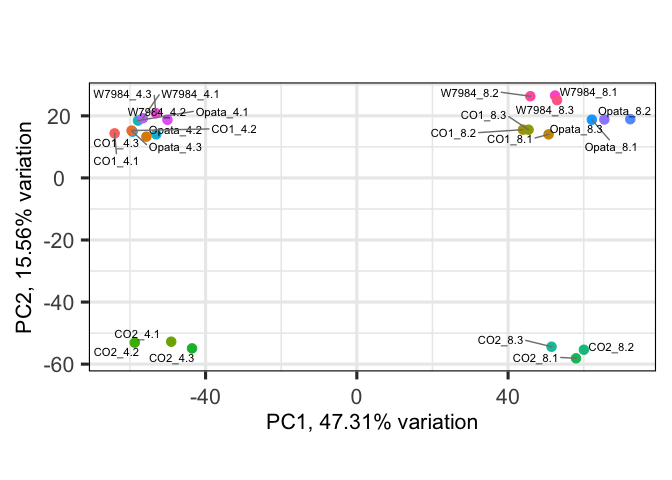
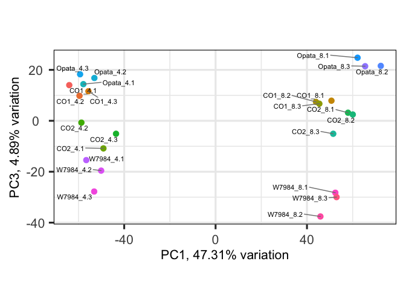
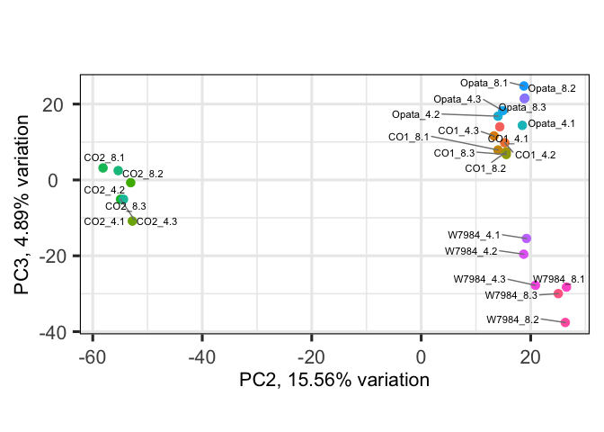
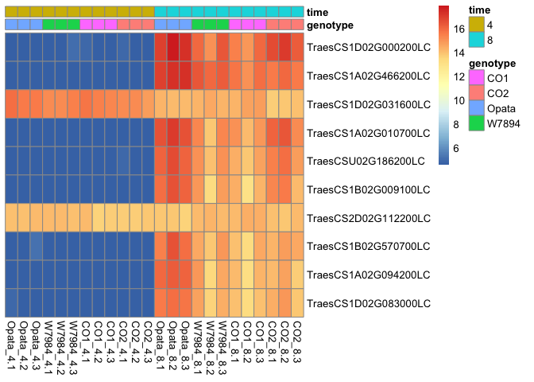

script\_S4: RNAseq\_analysis
================

All packages, data, and statistical analysis for reproducing RNA-seq
results reported in Taagen et al. 2021. Please see `script_S4.Rmd` for
full R script.

### Experimental design

**RNA sample collection specifics:** The plant tissue comes from the
maturing grains of 4 SynOpHIF haplotypes, at 4 and 8 DPA. In 2020 the
four haplotypes were grown in a randomized greenhouse, and tagged 40
spikes for the 4 DPA time point and randomly sampled sets of 10 spikes
across 4 biological reps. In addition, 8 spikes were tagged for the 8
DPA time point randomly sampled sets of 2 spikes across 4 biological
reps (fewer needed based on increased grain size). The RNA was extracted
using a modified hot borrate method, and 3 of the 4 biological reps were
sent to Novogene for sequencing (24 samples)

**Novogene specifics:**  
species: wheat  
sample type: RNA  
sample number: 24  
library type: non-directional, 150 bp, paired-end reads library  
amount of data per sample: \> 6G

**Load packages**

``` r
library(tidyverse) #version 1.3.0
library(sva) #version 3.36.0
library(DESeq2) #version 1.28.1
library(vsn) #version 3.56.0
library(PCAtools) #Bioconductor version 2.0.0
library(pheatmap) #version 1.0.12
library(reshape) #version 0.8.8
library(kableExtra) #version 1.1.0
library(gt) #R/gt version 0.2.2
library(ggpubr) # R/ggpubr package version 0.2.5 
library(ggbio) #Bioconductor version 1.36.0
library(biovizBase) #Bioconductor version 1.37.0
library(gghighlight) #Bioconductor version 0.3.0
library(goseq) #Bioconductor version 1.40.0
```

### Table 3, RNAseq HIF entry selection:

<!-- -->

## RNA-seq analysis pipeline

This pipeline uses command line scripts and R code. If you would like to
reproduce our results after the command line analysis, jump ahead to
section titled **“Differential expression analysis”**. If you would like
to re-produce our analysis from scratch, start here. When working with
the command line is required look for `#run in CL`. As written and
copied/pasted, the CL script will not run - we have commended where the
user may need to download / move / copy files, insert their own file
path, or navigate directories to execute the analysis. For example, our
working directory was `/workdir/et395` - if you see this, change it to
fit your path\!

### Download fastq data

**Sequencing data from from NCBI BioProject ID: PRJNA693003**  
The 48 paired-end fastq (.fq.gz) files are available for download here:
<https://www.ncbi.nlm.nih.gov/sra/PRJNA693003>  
Navigate through each `SRA-experiment` link, scroll down to the `Run`
table link, and then click the `Data access` tab. From here you can
right click the `Original format` fastq files and `Copy Link Address`.

``` r
#run in CL, 
wget #paste `Copy Link Address` for all 48 original format fastq files 
# copy files to your working directory
```

**Wheat reference genome assembly v1.0 and annotation v1.1**

``` r
#run in CL
# RefSeq v1.0 assembly
wget https://urgi.versailles.inra.fr/download/iwgsc/IWGSC_RefSeq_Assemblies/v1.0/iwgsc_refseqv1.0_all_chromosomes.zip
# check md5
wget https://urgi.versailles.inra.fr/download/iwgsc/IWGSC_RefSeq_Assemblies/v1.0/iwgsc_refseqv1.0_all_chromosomes.zip.md5
# RefSeq v1.1 annotation
wget https://urgi.versailles.inra.fr/download/iwgsc/IWGSC_RefSeq_Annotations/v1.1/iwgsc_refseqv1.1_genes_2017July06.zip
# check md5
wget https://urgi.versailles.inra.fr/download/iwgsc/IWGSC_RefSeq_Annotations/v1.1/iwgsc_refseqv1.1_genes_2017July06.zip.md5.txt
# copy files to your working directory
```

### Novogene QC sequencing results:

Q scores: \> Q30 for all 24 samples, probability of incorrect base call
is greater than 1 in 1000, or 99.9% accurate  
\* The sequencing quality score of a given base, Q, is defined by the
following equation: `Q = -10log10(e)`, where e is the estimated
probability of the base call being wrong. Higher Q scores indicate
smaller probability of error

Distribution of Sequencing Error Rate: 0.2-0.4% across 24 samples.  
\* Error rate grows with sequenced reads extension because of the
consumption of sequencing reagent. The phenomenon is common in the
Illumina high-throughput sequencing platform AND The reason for the high
error rate of the first six bases is that the random hex-primers and RNA
template bind incompletely in the process of cDNA synthesis

Distribution of A/T/G/C Base: results are not overly GC rich

Raw Data Filtering: remove reads containing adapters, reomve reads
containg undetermined (N) bases \> 10%, remove reads containing low
quality (Qscore \<= 5). The results indicate over 97% of reads were
clean.

**Examine quality of fastq data files**  
Pre-provided html output in GitHub folder `fastqc files`

``` r
#run in CL
# use mv dir/"file_common_code"* /your_working_directory to move all 24 sample folders into common folder
# for example mv A4_1/A* /workdir/et395/RNA_seq_fastq moves the first sample
find . -name "*.fq.gz" -print0 | xargs -0 -n 1 fastqc #runs fastqc on every sample file
#move html output over via filezilla for review
```

**FastQC results are in `file_S4.11.zip`**

FastQC file content descriptions
([source](https://rtsf.natsci.msu.edu/genomics/tech-notes/fastqc-tutorial-and-faq/)):

All samples passed without concern excpet for some GC content (all G)
overrepresented sequence

  - The overrepresentd `GGGG...` sequence is because illumina sequencer
    used 2 dyes, combo, and absence to read ATCG sequence, and the
    absence of dye is `G`. When the chemistry gets tired and sequencer
    approaching end of run there is no signal and that can be detetcted
    as `G`. This will not align to anything anyway so don’t need to
    worry about it.

### Index high confidence (HC) and low confidence (LC) LC annotated genome with STAR

``` r
#run in CL
#navigate to working directory
#copy in the sequencing data
#copy in the assembly file 161010_Chinese_Spring_v1.0_pseudomolecules.fasta
#copy in the annotation files IWGSC_v1.1_HC_20170706.gtf and IWGSC_v1.1_LC_20170706.gtf
export PATH=/programs/STAR:$PATH
mkdir STAR_genome
mkdir STAR_genome_LC
# these steps take a few hours to run
screen # and navigate to run / monitor these 2 processes 
# index with HC annotation - change to your file path!
STAR --runMode genomeGenerate --runThreadN 30 --genomeDir /workdir/et395/STAR_genome --genomeFastaFiles /workdir/et395/161010_Chinese_Spring_v1.0_pseudomolecules.fasta --sjdbGTFfile /workdir/et395/IWGSC_v1.1_HC_20170706.gtf --sjdbOverhang 149 --limitGenomeGenerateRAM=38800833920 --genomeSAsparseD 2
# index with LC annotation- change to your file path!
STAR --runMode genomeGenerate --runThreadN 30 --genomeDir /workdir/et395/STAR_genome_LC --genomeFastaFiles /workdir/et395/161010_Chinese_Spring_v1.0_pseudomolecules.fasta --sjdbGTFfile /workdir/et395/IWGSC_v1.1_LC_20170706.gtf --sjdbOverhang 149 --limitGenomeGenerateRAM=38800833920 --genomeSAsparseD 2 
```

### Align sequencing reads with indexed genomes

We will need a shell script for this - use FileZilla to upload the
script to your directory. You can edit the scripts we used
(HC,`file_S4.12.sh` and LC `file_S4.13.sh`) to match your directory file
path with bbEdit.

``` r
#run in CL
# HC alignment
STAR --genomeLoad LoadAndExit --genomeDir /workdir/et395/STAR_genome 
chmod +x runSTAR.sh #makes it executable
sh runSTAR.sh
STAR --genomeLoad Remove --genomeDir STAR_genome
# LC alignment
STAR --genomeLoad LoadAndExit --genomeDir /workdir/et395/STAR_genome_LC
chmod +x runSTAR_LC.sh
sh runSTAR_LC.sh 
STAR --genomeLoad Remove --genomeDir STAR_genome_LC
```

The output is one sorted BAM file per sample, and need to combine the 24
files for statistical analysis, cut the columns with the read counts for
nondirectional reads (column 2).

``` r
#run in CL
# want *_ReadsPerGene.out.tab for each sample
# HC sorting
paste A2_2_ReadsPerGene.out.tab A3_ReadsPerGene.out.tab A4_1_ReadsPerGene.out.tab B1_ReadsPerGene.out.tab B2_ReadsPerGene.out.tab B8_1_ReadsPerGene.out.tab C10_1_ReadsPerGene.out.tab C1_ReadsPerGene.out.tab C4_1_ReadsPerGene.out.tab D16_2_ReadsPerGene.out.tab D1_ReadsPerGene.out.tab D3_ReadsPerGene.out.tab E19_1_ReadsPerGene.out.tab E1_1_ReadsPerGene.out.tab E20_1_ReadsPerGene.out.tab F22_1_ReadsPerGene.out.tab F24_0_ReadsPerGene.out.tab F4_1_ReadsPerGene.out.tab G25_0_ReadsPerGene.out.tab G27_1_ReadsPerGene.out.tab G2_ReadsPerGene.out.tab H31_1_ReadsPerGene.out.tab H32_2_ReadsPerGene.out.tab H4_4_ReadsPerGene.out.tab | cut -f1,2,6,10,14,18,22,26,30,34,38,42,46,50,54,58,62,66,70,74,78,82,86,90,94 | tail -n +5 > gene_count_7.15.20.txt 
#gene name with positions, need IWGSC_v1.1_HC_20170706.gff3
grep -P "\tgene\t" IWGSC_v1.1_HC_20170706.gff3  > tmp_gene #extract just gene rows
cut -f 9 tmp_gene > tmp_gene_attr #cut gene name column
cut -c 4-23 tmp_gene_attr > tmp_gene_id # cut to just gene id 
cut -f 1,4,5 tmp_gene | paste tmp_gene_id -> gene_name_pos.txt #compile file and move with filezilla

# LC sorting
paste A2_2_ReadsPerGene.out.tab A3_ReadsPerGene.out.tab A4_1_ReadsPerGene.out.tab B1_ReadsPerGene.out.tab B2_ReadsPerGene.out.tab B8_1_ReadsPerGene.out.tab C10_1_ReadsPerGene.out.tab C1_ReadsPerGene.out.tab C4_1_ReadsPerGene.out.tab D16_2_ReadsPerGene.out.tab D1_ReadsPerGene.out.tab D3_ReadsPerGene.out.tab E19_1_ReadsPerGene.out.tab E1_1_ReadsPerGene.out.tab E20_1_ReadsPerGene.out.tab F22_1_ReadsPerGene.out.tab F24_0_ReadsPerGene.out.tab F4_1_ReadsPerGene.out.tab G25_0_ReadsPerGene.out.tab G27_1_ReadsPerGene.out.tab G2_ReadsPerGene.out.tab H31_1_ReadsPerGene.out.tab H32_2_ReadsPerGene.out.tab H4_4_ReadsPerGene.out.tab | cut -f1,2,6,10,14,18,22,26,30,34,38,42,46,50,54,58,62,66,70,74,78,82,86,90,94 | tail -n +5 > LC_gene_count_8.7.20.txt
#gene name with positions, need IWGSC_v1.1_LC_20170706.gff3 ./
grep -P "\tgene\t" IWGSC_v1.1_LC_20170706.gff3  > tmp_gene #extract just gene rows
cut -f 9 tmp_gene > tmp_gene_attr #cut gene name column
cut -c 4-23 tmp_gene_attr > tmp_gene_id # cut to just gene id 
cut -f 1,4,5 tmp_gene | paste tmp_gene_id -> LC_gene_name_pos.txt #compile file and move with filezilla
```

### Read count alignment summary

Source: each sample `Log.final.out`, summaraized in table format here

<!-- -->

<!-- -->

## HC gene annotation differential expression analysis

We begin with HC gene annotation complete analysis, followed by LC gene
annotation analysis.

**Batch effect with ComBat\_seq**

``` r
cts <- as.matrix(read.csv("https://raw.githubusercontent.com/etaagen/Taagen_2021_TPG/main/supplementary_4/file_S4.04.csv", row.names="gene_id")) 
#gene name with positions 
pos <- read.csv("https://raw.githubusercontent.com/etaagen/Taagen_2021_TPG/main/supplementary_4/file_S4.05.csv")
#need to filter for the gene names present in results

meta_data <- read.csv("https://raw.githubusercontent.com/etaagen/Taagen_2021_TPG/main/supplementary_4/file_S4.06.csv")
meta_data$condition <- factor(meta_data$condition)
meta_data$batch <- factor(meta_data$batch)
meta_data$genotype <- factor(meta_data$genotype)
meta_data$time <- factor(meta_data$time)

batch <- c(meta_data$batch) # 1 and 2 represent Novogene sequencing batches
group <- c(meta_data$time) #1 is 4 DPA, 2 is 8 DPA, using time as the group factor because largest PCA (see below)

adjusted_counts <- ComBat_seq(cts, batch=batch, group=group, full_mod=TRUE)
```

    ## Found 2 batches
    ## Using full model in ComBat-seq.
    ## Adjusting for 1 covariate(s) or covariate level(s)
    ## Estimating dispersions
    ## Fitting the GLM model
    ## Shrinkage off - using GLM estimates for parameters
    ## Adjusting the data

**Adjusted counts used as import for DESeq2**

``` r
dds <- DESeqDataSetFromMatrix(countData = adjusted_counts,
                              colData = meta_data,
                              design = ~ condition)
dds
```

    ## class: DESeqDataSet 
    ## dim: 107891 24 
    ## metadata(1): version
    ## assays(1): counts
    ## rownames(107891): TraesCS1A02G000100 TraesCS1A02G000200 ...
    ##   TraesCSU02G272900 TraesCSU02G272997
    ## rowData names(0):
    ## colnames(24): Opata_4.1 Opata_4.2 ... CO2_8.2 CO2_8.3
    ## colData names(8): rownames genotype ... batch fq.gz_name

**Differential expression, `DESeq()`**

``` r
dds <- DESeq(dds) 
```

**Variance Stabilizing Data Transformation**

``` r
vsd <- vst(dds, blind=FALSE)
#head(assay(vsd), 3)
meanSdPlot(assay(vsd))
```

<!-- -->

**PCA**

``` r
#need rownames and colnames to match
meta_data <- cbind(row.names = colnames(vsd), meta_data)
all(colnames(vsd) == rownames(meta_data))
```

    ## [1] TRUE

``` r
p <- pca(assay(vsd), removeVar = 0.1, metadata = meta_data)  #removing lower 10% of variables based on variance
screeplot(p) 
```

<!-- -->

``` r
biplot(p, x = "PC1", y = "PC2") 
```

<!-- -->

``` r
biplot(p, x = "PC1", y = "PC3")
```

<!-- -->

``` r
biplot(p, x = "PC2", y = "PC3")
```

<!-- -->

``` r
#pairsplot(p)
```

**Heatmap of count matrix**

``` r
#ordered by largest rowmean normalized differential expression counts, to smallest, showing top 10
select <- order(rowMeans(counts(dds,normalized=TRUE)),
                decreasing=TRUE)[1:10] 
df <- as.data.frame(colData(dds)[,c("genotype","time")])
pheatmap(assay(vsd)[select,], cluster_rows=FALSE, show_rownames=TRUE,
         cluster_cols=FALSE, annotation_col=df)
```

<!-- -->

**Heatmap of sample-to-sample correlations**

``` r
pheatmap(cor(assay(vsd)))
```

<!-- -->
Samples are quite similar within timpepoints, 4 DPA and 8 DPA, nearly
1:1 correlation. Across timepoints correlation decrease, but not below
\~0.8.

### Experimental conditions contrast

RNAseq captures are large amount of gene expression variability,
including housekeeping genes or metabolites that change expression
often. To capture the greatest variation / most unique genes we set a
stringent alpha and lfcThreshold of 0.01 and 2, respectively. For
example, `results(dds, contrast=c("condition", "1", "2"),
independentFiltering=TRUE, alpha=0.01, pAdjustMethod="BH",
parallel=TRUE, tidy=TRUE, lfcThreshold = 2)` For the sake of avodiing
repetition, in the html file we just provide code for the first the
condition analysis. To review all code please see the .Rmd file.

**Opata vs W7984, 4 DPA**

``` r
cond_1_2 <- results(dds, contrast=c("condition", "1", "2"), independentFiltering=TRUE, alpha=0.01, pAdjustMethod="BH", parallel=TRUE, tidy=TRUE, lfcThreshold = 2) 
#include gene positions
cond_1_2 <- cond_1_2 %>% 
  arrange(padj, ) %>% 
  inner_join(pos, by=c("row"="gene_id"))
#all chromosome plot
transformDfToGr(cond_1_2, seqnames = "chr", start = "start", end = "end") %>% 
  keepSeqlevels(c("chr1A", "chr1B", "chr1D", 
                  "chr2A", "chr2B", "chr2D", 
                  "chr3A", "chr3B", "chr3D", 
                  "chr4A", "chr4B", "chr4D",
                  "chr5A", "chr5B", "chr5D",
                  "chr6A", "chr6B", "chr6D",
                  "chr7A", "chr7B", "chr7D")) %>% 
  plotGrandLinear(aes(y = -log10(padj))) + # highlight.gr = qtl
  theme_classic() +
  geom_hline(yintercept=-log10(0.01), linetype="dashed", color = "red") + 
  theme(legend.position = "none", axis.text.x = element_text(angle = 90, vjust = 0.5)) +
  ggtitle("QTgw.cnl-5A Opata vs W7984, 4 DPA")
```

<!-- -->

``` r
#chromosome group 5
transformDfToGr(cond_1_2, seqnames = "chr", start = "start", end = "end") %>% 
  keepSeqlevels(c("chr5A", "chr5B", "chr5D"), pruning.mode = "coarse") %>% 
  plotGrandLinear(aes(y = -log10(padj)))+ #highlight.gr = qtl
  theme_classic() +
  geom_hline(yintercept=-log10(0.01), linetype="dashed", color = "red") + 
  theme(legend.position = "none") +
  ggtitle("Group 5 chromosomes, QTgw.cnl-5A Opata vs W7984, 4 DPA") 
```

<!-- -->

``` r
#highlight QTL
qtl_subgroup1 <- cond_1_2 %>% 
  filter(chr == "chr5A", start > 339757917, end < 349628635) %>% 
  arrange(start)
SA <- cond_1_2 %>% 
  filter(chr== "chr5A", start > 0, end < 250000000) %>% 
  arrange(start)

# QTL plot
cond_1_2 %>% 
filter(chr == "chr5A") %>% #compare all p vals, and have x axis be pos.
  arrange(start) %>% 
  ggplot(aes(x = start, y = -log10(padj))) +
    geom_point(shape = 1, na.rm = TRUE, color = "black") + 
    geom_point(aes(x = start, y = -log10(padj)), 
               data = SA, color = "gray48", shape = 1) + 
    geom_point(aes(x = start, y = -log10(padj)), 
               data = qtl_subgroup1, color = "#0072b2") + 
    geom_hline(yintercept=-log10(0.01), linetype="dashed", color = "red") + 
    geom_vline(xintercept = 250000000, linetype="dashed") + #aprox 5A centromere
    scale_x_continuous(name = "Chromosome 5A, bp", limits = c(0,709676514))+ #length of 5A
    theme_classic() +
    theme(legend.position = "none") +
    ggtitle("QTgw.cnl-5A Opata vs W7984, 4 DPA") 
```

<!-- -->

**Opata vs W7984, 8 DPA**

    ## using coord:genome to parse x scale

<!-- -->

    ## using coord:genome to parse x scale

<!-- --><!-- -->

**Condition CO1 vs W7984, 4 DPA**

    ## using coord:genome to parse x scale

<!-- -->

    ## using coord:genome to parse x scale

<!-- --><!-- -->

**Condition CO1 vs W7984, 8 DPA**

    ## using coord:genome to parse x scale

<!-- -->

    ## using coord:genome to parse x scale

<!-- --><!-- -->

**Condition CO2 vs W7984, 4 DPA**

    ## using coord:genome to parse x scale

<!-- -->

    ## using coord:genome to parse x scale

<!-- --><!-- -->

**Condition CO2 vs W7984, 8 DPA**

    ## using coord:genome to parse x scale

<!-- -->

    ## using coord:genome to parse x scale

<!-- --><!-- -->

**Condition Opata vs CO1, 4 DPA**

    ## using coord:genome to parse x scale

<!-- -->

    ## using coord:genome to parse x scale

<!-- --><!-- -->

**Condition Opata vs CO1, 8 DPA**

    ## using coord:genome to parse x scale

<!-- -->

    ## using coord:genome to parse x scale

<!-- --><!-- -->

**Condition Opata vs CO2, 4 DPA**

    ## using coord:genome to parse x scale

<!-- -->

    ## using coord:genome to parse x scale

<!-- --><!-- -->

**Condition Opata vs CO2, 8 DPA**

    ## using coord:genome to parse x scale

<!-- -->

    ## using coord:genome to parse x scale

<!-- --><!-- -->

### SNP variant check

We also explored SNP variants in the candidate QTL region, chr 5A
339757917 - 349628635 bp. We ran bcftools mpileup on the HC STAR
alignment .bam files for the 24 samples. The only SNP consistent across
replicates was a single 3’ variant SNP among W7984 samples in the gene
TraesCS5A02G16099, with annotation available in `file_S4.18.xlsx`. This
gene is not deferentially expressed, and the annotation does not suggest
it is a candidate for our phenotype.

### Chromosome 5AS exploration

**Chr 5AS heatmap** Sample groups 2 and 6 are from the W7984 haplotype.
The DE detected between Opata, Recombinant I and Recombinant II with
W7984 haplotypes clearly due to a lack of W7984 expression.

    ## Warning: Missing column names filled in: 'X1' [1]

    ## 
    ## ── Column specification ────────────────────────────────────────────────────────
    ## cols(
    ##   .default = col_double(),
    ##   X1 = col_character()
    ## )
    ## ℹ Use `spec()` for the full column specifications.

<!-- -->

Some genes on chromosome 5AS appear to be expressed for W7984 haplotype
samples. These genes are annotated and explored in the file
`file_S4.14.xlsx`. We believe the reads are misaligned to chr 5AS based
on high sequence similarity with a homoeolog and/or paralog gene
sequence.

    ## 
    ## ── Column specification ────────────────────────────────────────────────────────
    ## cols(
    ##   .default = col_double(),
    ##   X1 = col_character()
    ## )
    ## ℹ Use `spec()` for the full column specifications.

### Extract DE genes for Opata / CO1 / CO2 vs W7984 haplotype

``` r
#Opata vs W7984
Opata_W7984_4DPA_DE <- cond_1_2 %>% 
  filter(padj < 0.01) %>% 
  arrange(row) %>%  #575 genes, and need unique col names
  dplyr::rename(baseMean_OW_4DPA = baseMean, 
         log2FoldChange_OW_4DPA = log2FoldChange,
         lfcSE_OW_4DPA = lfcSE,
         stat_OW_4DPA = stat,
         pvalue_OW_4DPA = pvalue,
         padj_OW_4DPA = padj)

Opata_W7984_8DPA_DE <- cond_5_6 %>% 
  filter(padj < 0.01) %>% 
  arrange(row) %>%  #521 genes 
  dplyr::rename(baseMean_OW_8DPA = baseMean,
         log2FoldChange_OW_8DPA = log2FoldChange,
         lfcSE_OW_8DPA = lfcSE,
         stat_OW_8DPA = stat,
         pvalue_OW_8DPA = pvalue,
         padj_OW_8DPA = padj) 
 
#merge
Opata_W7984_DE <- full_join(Opata_W7984_4DPA_DE, Opata_W7984_8DPA_DE, by = c("row", "chr", "start", "end")) %>%
  dplyr::rename(gene_id = row) %>% 
  relocate(chr, start, end, .after = gene_id) #612 genes
 
#CO1 vs W7984
CO1_W7984_4DPA_DE <- cond_2_3 %>% 
  filter(padj < 0.01) %>% 
  arrange(row) %>%   #577 genes
  dplyr::rename(baseMean_CW_4DPA = baseMean, 
         log2FoldChange_CW_4DPA = log2FoldChange,
         lfcSE_CW_4DPA = lfcSE,
         stat_CW_4DPA = stat,
         pvalue_CW_4DPA = pvalue,
         padj_CW_4DPA = padj)
  
CO1_W7984_8DPA_DE <- cond_6_7 %>% 
  filter(padj < 0.01) %>% 
  arrange(row) %>% #523 genes 
  dplyr::rename(baseMean_CW_8DPA = baseMean,
         log2FoldChange_CW_8DPA = log2FoldChange,
         lfcSE_CW_8DPA = lfcSE,
         stat_CW_8DPA = stat,
         pvalue_CW_8DPA = pvalue,
         padj_CW_8DPA = padj) 
#merge
CO1_W7984_DE <- full_join(CO1_W7984_4DPA_DE, CO1_W7984_8DPA_DE,  by = c("row", "chr", "start", "end")) %>% 
  dplyr::rename(gene_id = row) %>% 
  relocate(chr, start, end, .after = gene_id)#616 genes

#CO2 vs W7984
CO2_W7984_4DPA_DE <- cond_2_4 %>% 
  filter(padj < 0.01) %>% 
  arrange(row) %>%   #577 genes
  dplyr::rename(baseMean_C2W_4DPA = baseMean, 
         log2FoldChange_C2W_4DPA = log2FoldChange,
         lfcSE_C2W_4DPA = lfcSE,
         stat_C2W_4DPA = stat,
         pvalue_C2W_4DPA = pvalue,
         padj_C2W_4DPA = padj)
  
CO2_W7984_8DPA_DE <- cond_6_8 %>% 
  filter(padj < 0.01) %>% 
  arrange(row) %>% #523 genes 
  dplyr::rename(baseMean_C2W_8DPA = baseMean,
         log2FoldChange_C2W_8DPA = log2FoldChange,
         lfcSE_C2W_8DPA = lfcSE,
         stat_C2W_8DPA = stat,
         pvalue_C2W_8DPA = pvalue,
         padj_C2W_8DPA = padj) 
#merge
CO2_W7984_DE <- full_join(CO2_W7984_4DPA_DE, CO2_W7984_8DPA_DE,  by = c("row", "chr", "start", "end")) %>% 
  dplyr::rename(gene_id = row) %>% 
  relocate(chr, start, end, .after = gene_id) #1485 genes


Haplotype_full_DE <- Opata_W7984_DE %>% 
  full_join(CO1_W7984_DE, by = c("gene_id", "chr", "start", "end")) %>% #648 genes
  full_join(CO2_W7984_DE, by = c("gene_id", "chr", "start", "end")) %>% #1540 genes
  arrange(chr, gene_id) 


Haplotype_overlap_DE_4DPA <- Haplotype_full_DE[complete.cases(Haplotype_full_DE[, c(10, 22, 34)]), ] %>%  #532 genes
  select(-c(11:16, 23:28, 35:40)) #helps with merge
            
Haplotype_overlap_DE_8DPA <-  Haplotype_full_DE[complete.cases(Haplotype_full_DE[, c(16, 28, 40)]), ] %>%  #469 genes 
  select(-c(5:10, 17:22, 29:34)) 
#merge

Haplotype_overlap_DE <- Haplotype_overlap_DE_4DPA %>% 
  full_join(Haplotype_overlap_DE_8DPA, by = c("gene_id", "chr", "start", "end")) #556 genes

Haplotype_padj_DE <- Haplotype_overlap_DE %>% 
  select(c(gene_id, chr, start, end, padj_OW_4DPA, padj_CW_4DPA, padj_C2W_4DPA, padj_OW_8DPA, padj_CW_8DPA, padj_C2W_8DPA)) 

#write.csv(Haplotype_padj_DE, "/Users/ellietaagen/Desktop/github/WheatCAP/RNA-seq/Haplotype_padj_DE.csv")
#file_S4.20.csv

#entries from W7984 that are expressed, but are they still DE? 
W7984_chr5AS_DE <- Haplotype_padj_DE %>%
  right_join(W7984_chr5AS, by = c("gene_id", "chr", "start", "end"))
#Of the 38 genes on 5AS that are expressed by W7984, 11 are DE (W7984 less expressed) - narrowing list to 27 genes for BLAST
```

**The 21 DE not on chromosome 5A show expression for 5A+ or 5A-
haplotype**
<!-- -->

## Gene ontology enrichment analysis

``` r
#run in CL
#For each chromosome .gff3 file from JBrowse https://urgi.versailles.inra.fr/jbrowseiwgsc/gmod_jbrowse/  
#In Linux combine all 21 chromosomes:
cat chr1A_HC_JBrowse.gff3 chr1B_HC_JBrowse.gff3 chr1D_HC_JBrowse.gff3 chr2A_HC_JBrowse.gff3 chr2B_HC_JBrowse.gff3 chr2D_HC_JBrowse.gff3 chr3A_HC_JBrowse.gff3 chr3B_HC_JBrowse.gff3 chr3D_HC_JBrowse.gff3 chr4A_HC_JBrowse.gff3 chr4B_HC_JBrowse.gff3 chr4D_HC_JBrowse.gff3 chr5A_HC_JBrowse.gff3 chr5B_HC_JBrowse.gff3 chr5D_HC_JBrowse.gff3 chr6A_HC_JBrowse.gff3 chr6B_HC_JBrowse.gff3 chr6D_HC_JBrowse.gff3 chr7A_HC_JBrowse.gff3 chr7B_HC_JBrowse.gff3 chr7D_HC_JBrowse.gff3 > RefSeqv1.1HC_JBrowse.gff3
#subset to only gene entries, and cut to the column with gene name and GO terms
awk '$3=="gene"' RefSeqv1.1HC_JBrowse.gff3 | cut -f9 > subset_genes #93509 genes 

grep -v "^_Derived" subset_genes > subset
grep -v "^_Name2=" subset > subset_previous # 90535 genes col 2 and 4

grep -v "^_Previous" subset > subset_Name2 #268 genes col 3 and 4

grep -v "^_Name2=" subset_genes > subset
grep -v "^_Previous" subset > subset_Derived #2716 genes col 2 and 4

# select the right columns
awk -F '[;]' '{print $2 $4 }' subset_previous > subset_previous_GO #one column, two variables
awk -F '[;]' '{print $3 $4 }' subset_Name2 > subset_Name2_GO #some outliers, filter again 
grep "Name" subset_Name2_GO > subset_Name2_GO_2 #262 genes
awk -F '[;]' '{print $2 $4 }' subset_Derived > subset_Derived_GO #some outliers, filter again
grep "_Go=" subset_Derived_GO > subset_Derived_GO_2  #2342 genes

#combine, and sort
cat subset_previous_GO subset_Name2_GO_2 subset_Derived_GO_2 | sort > subset_sorted #93139 genes

# characters 6-23 are gene name, 28- are GO
cut -c 6-23 subset_sorted > gene_names.txt
cut -c 28- subset_sorted > GOterms.txt
paste -d "," gene_names.txt GOterms.txt > RefSeqv1.1_HC_GOterms.txt
```

**GOseq data prep and analysis**

``` r
#need three vectors
#First, genes: all gene.id from transcriptome with DE noted with "1"
total <- data.frame(pos$gene_id)
total <- total %>% 
  dplyr::rename(gene_id = pos.gene_id)
DE_gene_id <- data.frame(Haplotype_padj_DE$gene_id, 1)
DE_gene_id <- DE_gene_id %>% 
  dplyr::rename(gene_id = Haplotype_padj_DE.gene_id,
         DE = X1)

merge <- left_join(total, DE_gene_id, by = "gene_id") 
merge[is.na(merge)] <- 0

DEgenes <- merge
DEgenes$gene_id <- as.factor(DEgenes$gene_id)
#just want a vector
DEgenes <- deframe(DEgenes)

#second, my_length_vector, gene.id and gene length
my_length_vector <- data.frame(pos$gene_id, pos$end-pos$start)
my_length_vector <- my_length_vector %>% 
  dplyr::rename(gene_id = pos.gene_id,
         length = pos.end...pos.start) 
my_length_vector$gene_id <- as.factor(my_length_vector$gene_id)  
my_length_vector$length <- as.numeric(my_length_vector$length) 
#just want a vector 
my_length_vector <- deframe(my_length_vector)

#third, gene2cat: GO terms for the DE genes tidydata format
no_col <- max(count.fields("https://raw.githubusercontent.com/etaagen/Taagen_2021_TPG/main/supplementary_4/file_S4.15.txt", sep = ","))
go_terms <- read.table("https://raw.githubusercontent.com/etaagen/Taagen_2021_TPG/main/supplementary_4/file_S4.15.txt", sep=",", fill=TRUE, header = F, col.names=c("gene_id",1:no_col))
Gene_names <- as.vector(go_terms$gene_id)
go_terms <- go_terms[, -1]
go_terms_list <- as.list(as.data.frame(t(go_terms)))
names(go_terms_list) <- Gene_names 

#Fitting the Probability Weighting Function (PWF)
pwf = nullp(DEgenes, bias.data = my_length_vector)
```

<!-- -->

``` r
#calculate the over and under expressed GO categories among DE genes
GO.wall = goseq(pwf, gene2cat = go_terms_list) #use_genes_without_cat=TRUE
head(GO.wall, 10)
```

    ##        category over_represented_pvalue under_represented_pvalue numDEInCat
    ## 5271 GO:0031640            6.551528e-07                0.9999999          9
    ## 2105 GO:0007021            2.331576e-04                0.9999943          3
    ## 1255 GO:0005085            5.820225e-04                0.9999396          5
    ## 2918 GO:0009630            9.970309e-04                0.9997238         11
    ## 9282 GO:1900425            1.344378e-03                0.9999811          2
    ## 1010 GO:0004526            1.445220e-03                0.9998165          5
    ## 1392 GO:0005655            1.604397e-03                0.9997911          5
    ## 2992 GO:0009737            2.000024e-03                0.9990626         24
    ## 8446 GO:0070125            2.934499e-03                0.9999387          2
    ## 8652 GO:0071173            2.952443e-03                1.0000000          1
    ##      numInCat                                                 term ontology
    ## 5271      324                   killing of cells of other organism       BP
    ## 2105       15                             tubulin complex assembly       BP
    ## 1255      102           guanyl-nucleotide exchange factor activity       MF
    ## 2918      368                                         gravitropism       BP
    ## 9282        8 negative regulation of defense response to bacterium       BP
    ## 1010       96                              ribonuclease P activity       MF
    ## 1392      101                     nucleolar ribonuclease P complex       CC
    ## 2992     1971                            response to abscisic acid       BP
    ## 8446        8               mitochondrial translational elongation       BP
    ## 8652        1                          spindle assembly checkpoint       BP

``` r
#subset for significant enrichment
enriched.GO = GO.wall$category[p.adjust(GO.wall$over_represented_pvalue, method="BH") < 0.05]
enriched.GO
```

    ## [1] "GO:0031640"

Despite the lack of GO enrichment terms, we decided to filter the DEGs
based on presence of at least one GO term related to grain development
based on the phenotypes associated with chromosome 5AS structural
variation. This annotation and filtering took place in `file_S4.17.xlsx`
and informed the list of candidate genes (Table 4)

``` r
#need to filter the DEGs to single name rep (multiple GO terms share one gene)
filter <- read_csv("https://raw.githubusercontent.com/etaagen/Taagen_2021_TPG/main/supplementary_4/file_S4.16.csv")
filter <- filter[!duplicated(filter$DEGs), ]
filter <- filter %>% 
  dplyr::rename("gene_id" = "DEGs")
filter <- Haplotype_padj_DE %>%
  right_join(filter, by = c("gene_id")) %>% 
  arrange(chr)

sum(is.na(filter$padj_OW_4DPA))
```

    ## [1] 10

``` r
sum(is.na(filter$padj_OW_8DPA))
```

    ## [1] 52

``` r
check <- dds_counts %>%
  right_join(filter, by = c("gene_id")) 

check <- check[complete.cases(check), ]

o <- check$Opata_4.1 - check$Opata_8.1
o <- check$Opata_4.2 - check$Opata_8.2
o <- check$CO1_4.1 - check$CO1_8.1
o <- check$CO2_4.1 - check$CO2_8.1
count(o < 0)
```

    ## [1] 51

### Table 4: candidate genes

<!-- -->

## LC gene annotation differential expression analysis

We did not pursue additional analysis with the LC gene annotation beyond
identifying DEGs.

**Batch effect with ComBat\_seq**

``` r
cts <- as.matrix(read.csv("https://raw.githubusercontent.com/etaagen/Taagen_2021_TPG/main/supplementary_4/file_S4.10.csv", row.names="gene_id")) 
#gene name with positions 
pos <- read.csv("https://raw.githubusercontent.com/etaagen/Taagen_2021_TPG/main/supplementary_4/file_S4.10.1.csv", header = TRUE)
#already loaded from HC analysis 
#meta_data <- read.csv("https://raw.githubusercontent.com/etaagen/Taagen_2021_TPG/main/supplementary_4/file_S4.06.csv")
#meta_data$condition <- factor(meta_data$condition)
#meta_data$batch <- factor(meta_data$batch)
#meta_data$genotype <- factor(meta_data$genotype)
#meta_data$time <- factor(meta_data$time)

batch <- c(meta_data$batch) # 1 is overseas, 2 is US 
group <- c(meta_data$time) #1 is 4 DPA, 2 is 8 DPA, using time as the group factor because largest PCA

adjusted_counts <- ComBat_seq(cts, batch=batch, group=group, full_mod=TRUE)
```

    ## Found 2 batches
    ## Using full model in ComBat-seq.
    ## Adjusting for 1 covariate(s) or covariate level(s)
    ## Estimating dispersions
    ## Fitting the GLM model
    ## Shrinkage off - using GLM estimates for parameters
    ## Adjusting the data

**Adjusted counts used as import for DESeq2**

``` r
dds <- DESeqDataSetFromMatrix(countData = adjusted_counts,
                              colData = meta_data,
                              design = ~ condition)
dds
```

    ## class: DESeqDataSet 
    ## dim: 161537 24 
    ## metadata(1): version
    ## assays(1): counts
    ## rownames(161537): TraesCS1A02G000100LC TraesCS1A02G000200LC ...
    ##   TraesCSU02G669100LC TraesCSU02G669200LC
    ## rowData names(0):
    ## colnames(24): Opata_4.1 Opata_4.2 ... CO2_8.2 CO2_8.3
    ## colData names(8): rownames genotype ... batch fq.gz_name

**Differential expression, `DESeq()`**

``` r
dds <- DESeq(dds) 
```

**Variance Stabilizing Data Transformation**

``` r
vsd <- vst(dds, blind=FALSE)
#head(assay(vsd), 3)

meanSdPlot(assay(vsd))
```

<!-- -->

**PCA**

``` r
meta_data <- cbind(row.names = colnames(vsd), meta_data)

all(colnames(vsd) == rownames(meta_data))
```

    ## [1] TRUE

``` r
p <- pca(assay(vsd), removeVar = 0.1, metadata = meta_data) #removing lower 10% of variables based on variance
screeplot(p) 
```

    ## Warning: Removed 2 row(s) containing missing values (geom_path).

    ## Warning: Removed 2 rows containing missing values (geom_point).

<!-- -->

``` r
biplot(p) #less variation in PC1 than with the DESeq2 method...but analyzing by sample not genotype and time
```

<!-- -->

``` r
biplot(p, x = "PC1", y = "PC3")
```

<!-- -->

``` r
biplot(p, x = "PC2", y = "PC3")
```

<!-- -->

``` r
#pairsplot(p)
```

**Heatmap of count matrix**

``` r
#ordered by largest rowmean normalized differential expression counts, to smallest, showing top 10
select <- order(rowMeans(counts(dds,normalized=TRUE)),
                decreasing=TRUE)[1:10] 
df <- as.data.frame(colData(dds)[,c("genotype","time")])
pheatmap(assay(vsd)[select,], cluster_rows=FALSE, show_rownames=TRUE,
         cluster_cols=FALSE, annotation_col=df)
```

<!-- -->

**Heatmap of sample-to-sample correlations**

``` r
pheatmap(cor(assay(vsd)))
```

<!-- -->
Samples are quite similar within timpepoints, 4 DPA and 8 DPA, nearly
1:1 correlation. Across timepoints correlation decrease, but not below
\~0.8.

### Experimental conditions contrast, LC

RNAseq captures are large amount of gene expression variability,
including housekeeping genes or metabolites that change expression
often. To capture the greatest variation / most unique genes we set a
stringent alpha and lfcThreshold of 0.01 and 2, respectively. For
example, `results(dds, contrast=c("condition", "1", "2"),
independentFiltering=TRUE, alpha=0.01, pAdjustMethod="BH",
parallel=TRUE, tidy=TRUE, lfcThreshold = 2)` For the sake of avoiding
repetition, in the html file we just provide code for the first the
condition analysis. To review all code please see the .Rmd file.

**Opata vs W7984, 4 DPA**

    ## using coord:genome to parse x scale

<!-- -->

    ## using coord:genome to parse x scale

<!-- --><!-- -->

**Opata vs W7984, 8 DPA**

    ## using coord:genome to parse x scale

<!-- -->

    ## using coord:genome to parse x scale

<!-- --><!-- -->

**Condition CO1 vs W7984, 4 DPA**

    ## using coord:genome to parse x scale

<!-- -->

    ## using coord:genome to parse x scale

<!-- --><!-- -->

**Condition CO1 vs W7984, 8 DPA**

    ## using coord:genome to parse x scale

<!-- -->

    ## using coord:genome to parse x scale

<!-- --><!-- -->

**Condition CO2 vs W7984, 4 DPA**

    ## using coord:genome to parse x scale

<!-- -->

    ## using coord:genome to parse x scale

<!-- --><!-- -->

**Condition CO2 vs W7984, 8 DPA**

    ## using coord:genome to parse x scale

<!-- -->

    ## using coord:genome to parse x scale

<!-- --><!-- -->

**Condition Opata vs CO1, 4 DPA**

    ## using coord:genome to parse x scale

<!-- -->

    ## using coord:genome to parse x scale

<!-- --><!-- -->

**Condition Opata vs CO1, 8 DPA**

    ## using coord:genome to parse x scale

<!-- -->

    ## using coord:genome to parse x scale

<!-- --><!-- -->

**Condition Opata vs CO2, 4 DPA**

    ## using coord:genome to parse x scale

<!-- -->

    ## using coord:genome to parse x scale

<!-- --><!-- -->

**Condition Opata vs CO2, 8 DPA**

    ## using coord:genome to parse x scale

<!-- -->

    ## using coord:genome to parse x scale

<!-- --><!-- -->
